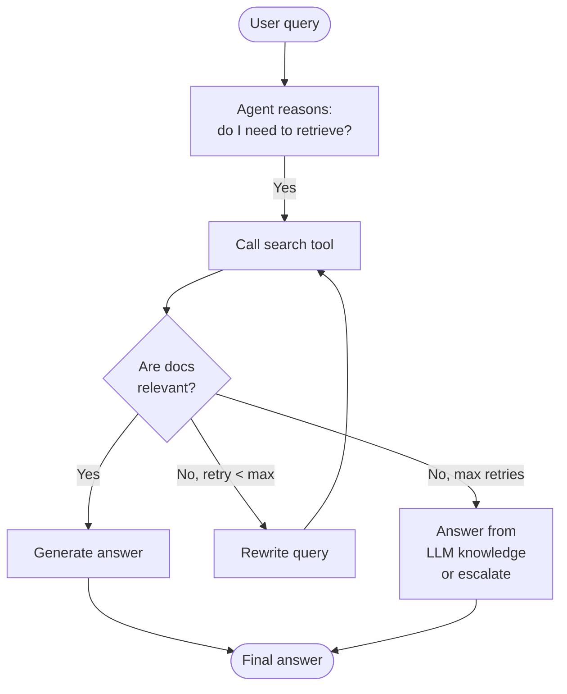

# Agentic RAG

Standard RAG is a fixed pipeline: retrieve once, then generate. Agentic RAG replaces that pipeline with a reasoning loop where an LLM decides when to retrieve, what to retrieve, whether the retrieved documents are good enough, and whether to try again — turning RAG into a goal-directed process.

## What you'll learn

- Core agentic patterns: tool-use, query routing, self-querying, and iterative retrieval
- Corrective RAG (CRAG): grade retrieved docs, re-retrieve if they are insufficient
- How to model the agent loop with a Mermaid diagram
- A pseudocode sketch of an agentic RAG system using Ollama tool-calling concepts

## Core patterns

### Tool-using retrieval agent

The LLM is given a `search` tool. It calls the tool when it decides retrieval is needed, inspects the results, and either answers or calls the tool again with a refined query.

### Query routing

A classifier (or the LLM itself) routes queries to the right retriever: vector store for semantic questions, SQL database for structured data, web search for current events.

### Self-querying

The LLM parses a natural-language query into a structured filter + semantic query. Example: *"papers about attention mechanisms published after 2022"* becomes `{"year": {">": 2022}, "query": "attention mechanism"}`.

### Corrective RAG (CRAG)

CRAG adds a grading step after retrieval. If retrieved documents are deemed irrelevant, the agent reformulates and re-retrieves — possibly from a different source.

## The agentic loop



## Pseudocode — agentic RAG with Ollama

Ollama supports tool/function calling with models like `llama3.2`. The pattern below shows the structure; adapt to your retrieval backend.

```python
# agentic_rag.py
import ollama
import json
import chromadb
from chromadb.utils.embedding_functions import SentenceTransformerEmbeddingFunction

# --- Retriever setup ---
ef = SentenceTransformerEmbeddingFunction("all-MiniLM-L6-v2")
client = chromadb.Client()
col = client.create_collection("agent_demo", embedding_function=ef)
col.add(
    documents=[
        "HNSW indexes trade memory for fast approximate nearest-neighbor search.",
        "Reciprocal Rank Fusion combines multiple ranked lists without score normalization.",
        "Cross-encoders score query-document pairs jointly, improving reranking quality.",
    ],
    ids=["d0", "d1", "d2"],
)

# --- Tool definition ---
search_tool = {
    "type": "function",
    "function": {
        "name": "search_knowledge_base",
        "description": "Search the local knowledge base for relevant documents.",
        "parameters": {
            "type": "object",
            "properties": {
                "query": {"type": "string", "description": "The search query."},
                "top_k": {"type": "integer", "description": "Number of results.", "default": 3},
            },
            "required": ["query"],
        },
    },
}


def search_knowledge_base(query: str, top_k: int = 3) -> list[str]:
    results = col.query(query_texts=[query], n_results=top_k)
    return results["documents"][0]


def grade_docs(query: str, docs: list[str]) -> bool:
    """Ask the LLM to grade whether docs are relevant to query."""
    joined = "\n".join(f"- {d}" for d in docs)
    prompt = (
        f"Query: {query}\n\nDocuments:\n{joined}\n\n"
        "Are these documents relevant to the query? Answer YES or NO only."
    )
    r = ollama.chat(model="llama3.2",
                    messages=[{"role": "user", "content": prompt}])
    return "YES" in r["message"]["content"].upper()


def run_agentic_rag(user_query: str, max_retries: int = 2) -> str:
    messages = [
        {"role": "system", "content": "You are a helpful assistant with access to a knowledge base. Use the search tool when you need information."},
        {"role": "user", "content": user_query},
    ]

    for attempt in range(max_retries + 1):
        response = ollama.chat(
            model="llama3.2",
            messages=messages,
            tools=[search_tool],
        )
        msg = response["message"]

        # If no tool call, model answered from context
        if not msg.get("tool_calls"):
            return msg["content"]

        # Execute tool calls
        all_docs = []
        for tc in msg["tool_calls"]:
            args = tc["function"]["arguments"]
            if isinstance(args, str):
                args = json.loads(args)
            docs = search_knowledge_base(**args)
            all_docs.extend(docs)

        # Grade retrieved docs
        if not grade_docs(user_query, all_docs) and attempt < max_retries:
            # Rewrite and retry
            messages.append({"role": "assistant", "content": "Retrieved documents were not relevant. Reformulating query."})
            messages.append({"role": "user", "content": f"The previous search was insufficient. Try a different angle: {user_query}"})
            continue

        # Inject docs as tool result and let model generate
        context = "\n".join(all_docs)
        messages.append(msg)
        messages.append({
            "role": "tool",
            "content": context,
        })
        final = ollama.chat(model="llama3.2", messages=messages)
        return final["message"]["content"]

    return "Could not retrieve sufficient information."


if __name__ == "__main__":
    answer = run_agentic_rag("How does HNSW handle memory usage?")
    print(answer)
```

!!! note "Model support"
    Tool-calling works best with instruction-tuned models. `llama3.2` supports it natively in Ollama. Check `ollama list` and ensure you have a recent version.

!!! warning "Limit your retry loops"
    Always set a hard cap (`max_retries`) on retrieval loops. An unconstrained agent can spiral into repeated retrievals, driving up latency and cost. Two to three retries is usually sufficient.

## Query routing example

```python
# query_router.py
import ollama

ROUTE_PROMPT = """Classify the query into one of: [vector_search, sql_query, web_search, direct_answer].
Output ONLY the label.

Query: {query}"""

def route_query(query: str) -> str:
    r = ollama.chat(
        model="llama3.2",
        messages=[{"role": "user", "content": ROUTE_PROMPT.format(query=query)}]
    )
    return r["message"]["content"].strip().lower()

print(route_query("What is the capital of France?"))          # direct_answer
print(route_query("Find papers about transformers post 2023")) # web_search
print(route_query("How many orders were placed last week?"))   # sql_query
```

## Next steps

- [Query transformation](query-transformation.md) — pre-process queries before the agent retrieves
- [Graph RAG](graph-rag.md) — extend the agent's retrieval with structured knowledge graphs
