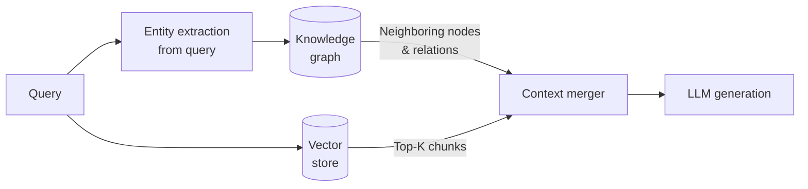

# Graph RAG

Graph RAG augments vector retrieval with a knowledge graph, enabling multi-hop reasoning and global structural queries that flat vector search cannot handle — such as "how are concept A and concept B related?" or "what does this entity depend on?"

## What you'll learn

- What knowledge graphs add that vector search cannot provide
- How to extract entities and relations from text using an LLM prompt
- The graph + vector hybrid retrieval pattern
- When to use GraphRAG and when plain vector RAG is enough
- Tools and trade-offs

## Why graphs complement vectors

Vector search answers *"what documents are semantically similar to this query?"* — it operates on local similarity. A knowledge graph answers *"how are these concepts connected?"* — it captures global structure and multi-hop paths.

| Query type | Vector RAG | Graph RAG |
|---|---|---|
| "What is HNSW?" | Excellent | Overkill |
| "What indexes does ChromaDB support?" | Good | Good |
| "Which components depend on the embedding model?" | Weak | Strong |
| "Summarize all topics related to retrieval" | Weak (misses links) | Strong |
| "How does chunking affect indexing and then retrieval?" | Weak | Strong |

## Entity and relation extraction

The first step in building a knowledge graph from text is extracting structured triples (subject, relation, object) using an LLM:

```python
# extract_graph.py
import ollama
import json

EXTRACT_PROMPT = """Extract knowledge graph triples from the text below.
Return a JSON array of objects with keys: "subject", "relation", "object".
Extract only factual relationships stated in the text. Output ONLY valid JSON.

Text: {text}"""

def extract_triples(text: str) -> list[dict]:
    r = ollama.chat(
        model="llama3.2",
        messages=[{"role": "user", "content": EXTRACT_PROMPT.format(text=text)}]
    )
    raw = r["message"]["content"].strip()
    # Strip markdown fences if present
    if raw.startswith("```"):
        raw = raw.split("```")[1]
        if raw.startswith("json"):
            raw = raw[4:]
    return json.loads(raw.strip())


sample = (
    "ChromaDB is a vector database that supports HNSW indexing. "
    "HNSW is an approximate nearest-neighbor algorithm. "
    "ChromaDB can be used with sentence-transformers for embedding."
)

triples = extract_triples(sample)
for t in triples:
    print(f"  ({t['subject']}) --[{t['relation']}]--> ({t['object']})")
```

Expected output:

```text
  (ChromaDB) --[is a]--> (vector database)
  (ChromaDB) --[supports]--> (HNSW indexing)
  (HNSW) --[is an]--> (approximate nearest-neighbor algorithm)
  (ChromaDB) --[used with]--> (sentence-transformers)
```

## Graph + vector hybrid retrieval



1. Extract entities mentioned in the query
2. Traverse the graph: fetch the subgraph around those entities (1–2 hops)
3. Also retrieve top-K vector chunks as usual
4. Merge graph context + chunk context into the prompt
5. Generate

## Building a simple in-memory graph

```python
# simple_graph.py
from collections import defaultdict

class KnowledgeGraph:
    def __init__(self):
        self.edges: dict[str, list[tuple[str, str]]] = defaultdict(list)

    def add_triple(self, subject: str, relation: str, obj: str):
        self.edges[subject.lower()].append((relation, obj))
        self.edges[obj.lower()].append((f"inverse:{relation}", subject))

    def get_neighbors(self, entity: str, hops: int = 1) -> list[str]:
        visited, queue = set(), [entity.lower()]
        context = []
        for _ in range(hops):
            next_queue = []
            for node in queue:
                for rel, neighbor in self.edges.get(node, []):
                    fact = f"{node} --[{rel}]--> {neighbor}"
                    if fact not in visited:
                        visited.add(fact)
                        context.append(fact)
                        next_queue.append(neighbor.lower())
            queue = next_queue
        return context


kg = KnowledgeGraph()
kg.add_triple("ChromaDB", "supports", "HNSW indexing")
kg.add_triple("HNSW", "is a", "nearest-neighbor algorithm")
kg.add_triple("ChromaDB", "used with", "sentence-transformers")

print(kg.get_neighbors("chromadb", hops=2))
```

## When to use Graph RAG

!!! tip "Use Graph RAG when"
    - Your domain has rich, explicit relationships (biomedical, legal, engineering)
    - Users ask multi-hop questions: "what depends on what?"
    - You need global summarization across connected concepts
    - Precision on entity-specific queries is critical

!!! warning "Avoid Graph RAG when"
    - Your corpus is unstructured prose without clear entities and relations
    - Query patterns are purely semantic similarity
    - You need fast time-to-production — graph construction is expensive to maintain

## Production tools

| Tool | Notes |
|---|---|
| **Neo4j** | Mature graph DB with Cypher query language; LangChain integration available |
| **Microsoft GraphRAG** | Open-source library for community-level graph summarization at scale |
| **NetworkX** | Pure-Python in-memory graphs; good for prototyping (used above) |
| **Kuzu** | Embeddable graph DB, good for local/offline use |

!!! note "Extraction quality matters"
    The graph is only as good as your extraction. Use few-shot prompts, validate triples against a schema, and consider human review for high-stakes domains. Noisy graphs degrade answer quality.

## Next steps

- [Agentic RAG](agentic-rag.md) — agents can traverse knowledge graphs as one of several tools
- [Evaluation](evaluation.md) — measure whether graph context improves faithfulness and relevance scores
