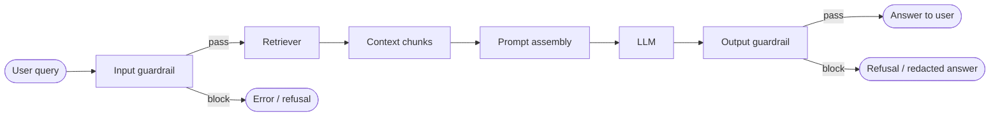

# Guardrails

Guardrails are validation and filtering layers that sit at the boundaries of your RAG pipeline — checking what goes in and what comes out. They are your last programmatic line of defence after prompt design and retrieval controls.

## What you'll learn

- Where guardrails sit in a RAG pipeline (with a diagram)
- Input validation and sanitization
- PII detection and redaction
- Output filtering: ungroundedness, toxicity, and policy violations
- Llama Guard and NeMo Guardrails — what they do and how they fit
- A practical combined guardrail sketch you can drop into a project

---

## Where guardrails sit



Input guardrails run **before** the retriever and LLM. Output guardrails run **after** generation but **before** the response reaches the user. Both layers are necessary — input guards reduce attack surface; output guards catch what slips through.

---

## Input guardrails

### Query validation

Reject or flag queries that match known attack patterns before they trigger retrieval. This limits the damage from direct prompt injection and reduces pointless LLM calls.

```python
import re
from dataclasses import dataclass

INJECTION_PATTERNS = [
    r"ignore (all |previous )?instructions",
    r"you are now (in )?",
    r"\[system",
    r"disregard (your |all )?",
    r"act as (an? )?",
    r"override",
]

@dataclass
class GuardrailResult:
    passed: bool
    reason: str = ""

def check_input(query: str) -> GuardrailResult:
    lowered = query.lower()
    for pattern in INJECTION_PATTERNS:
        if re.search(pattern, lowered):
            return GuardrailResult(
                passed=False,
                reason=f"Query matches injection pattern: {pattern!r}",
            )
    if len(query.strip()) == 0:
        return GuardrailResult(passed=False, reason="Empty query")
    if len(query) > 2000:
        return GuardrailResult(passed=False, reason="Query exceeds length limit")
    return GuardrailResult(passed=True)
```

### PII detection and redaction

If your RAG system handles user-submitted text (form data, support tickets, uploaded files), redact PII before it touches the LLM or gets logged.

```python
# pip install presidio-analyzer presidio-anonymizer
# python -m spacy download en_core_web_lg

from presidio_analyzer import AnalyzerEngine
from presidio_anonymizer import AnonymizerEngine

analyzer = AnalyzerEngine()
anonymizer = AnonymizerEngine()

PII_ENTITIES = [
    "PERSON", "EMAIL_ADDRESS", "PHONE_NUMBER",
    "CREDIT_CARD", "IBAN_CODE", "IP_ADDRESS",
    "US_SSN", "LOCATION",
]

def redact_pii(text: str, language: str = "en") -> str:
    results = analyzer.analyze(
        text=text, entities=PII_ENTITIES, language=language
    )
    anonymized = anonymizer.anonymize(text=text, analyzer_results=results)
    return anonymized.text

# Usage
safe_query = redact_pii("My name is Jane Smith and my email is jane@example.com.")
# → "My name is <PERSON> and my email is <EMAIL_ADDRESS>."
```

[Microsoft Presidio](https://microsoft.github.io/presidio/) (MIT licence) powers the detection above. For a lighter option, spaCy NER or regex patterns cover the most common entity types.

---

## Output guardrails

### Ungroundedness detection

If the model's answer contains claims not supported by the retrieved context, it may be hallucinating. A simple heuristic: ask the model (or a cheaper judge model) whether the answer is entailed by the context.

```python
GROUNDEDNESS_PROMPT = """You are a fact-checker.

CONTEXT:
{context}

ANSWER:
{answer}

Is every factual claim in the ANSWER supported by the CONTEXT?
Reply with one word: YES or NO."""

def is_grounded(answer: str, context: str, llm) -> bool:
    prompt = GROUNDEDNESS_PROMPT.format(context=context, answer=answer)
    verdict = llm.invoke(prompt).content.strip().upper()
    return verdict.startswith("YES")

def safe_answer(answer: str, context: str, llm) -> str:
    if not is_grounded(answer, context, llm):
        return (
            "I was unable to find a reliable answer to your question "
            "in the available documents. Please consult a primary source."
        )
    return answer
```

For production use, replace this heuristic with a dedicated faithfulness metric from TruLens or DeepEval (covered on the [observability](observability.md) page).

### Combining input and output guardrails

```python
def rag_with_guardrails(query: str, chain, llm) -> str:
    # 1. Input check
    result = check_input(query)
    if not result.passed:
        return f"Request blocked: {result.reason}"

    # 2. PII redaction on query
    safe_query = redact_pii(query)

    # 3. Retrieve and generate
    response = chain.invoke({"query": safe_query})
    answer = response["result"]
    context = "\n".join(
        doc.page_content for doc in response.get("source_documents", [])
    )

    # 4. Output check
    return safe_answer(answer, context, llm)
```

---

## Llama Guard

[Llama Guard](https://ai.meta.com/research/publications/llama-guard-llm-based-input-output-safeguard-for-human-ai-conversations/) is an open-weights LLM fine-tuned by Meta specifically for content safety classification. It can run locally and evaluates both user messages and model responses against a configurable set of harm categories (violence, hate speech, self-harm, illegal activity, and others).

**How it fits in a RAG pipeline:**

- Run Llama Guard as an *output* guardrail by passing `(user_message, assistant_response)` pairs to it.
- It returns `safe` or `unsafe [category code]`.
- Llama Guard 3 (released late 2024) supports multi-turn conversations and code safety.

```python
# Pseudocode — exact API depends on your serving setup (Ollama, vLLM, etc.)
def llama_guard_check(user_msg: str, assistant_msg: str, guard_client) -> bool:
    verdict = guard_client.classify(
        conversation=[
            {"role": "user", "content": user_msg},
            {"role": "assistant", "content": assistant_msg},
        ]
    )
    return verdict.strip().lower().startswith("safe")
```

See [local-serving](../tools/local-serving.md) and [Ollama](../tools/ollama.md) for how to run Llama Guard locally.

---

## NeMo Guardrails

[NVIDIA NeMo Guardrails](https://github.com/NVIDIA/NeMo-Guardrails) is an open-source (Apache-2.0) toolkit for adding programmable guardrail flows — called *Colang* scripts — to any LLM application. It supports:

- **Topical rails** — keep the model on-topic (refuse off-topic queries).
- **Fact-checking rails** — verify answers against a knowledge base.
- **Jailbreak detection rails** — detect adversarial phrasing.
- **Output moderation rails** — filter unsafe or policy-violating responses.

NeMo Guardrails wraps your existing LLM call, so it can sit around a LangChain chain or a raw API call without restructuring your pipeline.

```bash
pip install nemoguardrails
```

```colang
# config/rails.co — a simple topical rail
define user ask off topic
  "tell me a joke"
  "what's the weather"

define bot refuse off topic
  "I can only answer questions about the documents in this knowledge base."

define flow
  user ask off topic
  bot refuse off topic
```

```python
from nemoguardrails import RailsConfig, LLMRails

config = RailsConfig.from_path("./config")
rails = LLMRails(config)

response = rails.generate(
    messages=[{"role": "user", "content": "What is the refund policy?"}]
)
```

---

## Guardrail design principles

!!! warning "Guardrails are not a substitute for prompt hygiene"
    Guardrails catch failures at the boundary. They do not fix an insecure prompt structure. Always apply [spotlighting and delimiting](prompt-injection-security.md) first; use guardrails as the safety net beneath it.

- **Layer your defences.** Input guards, output guards, and prompt-level mitigations all serve different threat models.
- **Fail closed, not open.** When a guardrail is uncertain, refuse and ask for clarification rather than passing through.
- **Log every block.** Blocked requests are high-signal data for improving your pipeline and detecting attack campaigns.
- **Tune thresholds carefully.** Overly aggressive guardrails degrade user experience. Calibrate on a representative test set.

---

## Next steps

- [Prompt Injection & Security](prompt-injection-security.md) — the threat model that guardrails defend against.
- [Observability](observability.md) — instrument guardrail decisions as spans so you can track block rates over time.
- [Prompting for RAG](../foundations/prompting-rag.md) — write system prompts that reduce the attack surface guardrails need to cover.
