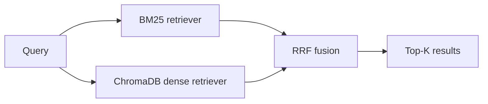

# Hybrid Search

Hybrid search combines dense vector retrieval with sparse keyword (BM25) retrieval so that each method compensates for the other's blind spots, giving you broader, more robust recall across diverse query types.

## What you'll learn

- Why dense-only and sparse-only retrieval each fail in predictable ways
- How BM25 works and why it excels at exact-term matching
- How to fuse results from two retrievers using Reciprocal Rank Fusion (RRF)
- When to reach for hybrid search (acronyms, IDs, rare proper nouns)
- A runnable local example with `rank_bm25` and ChromaDB

## Why neither retriever is enough alone

| Retrieval type | Strength | Weakness |
|---|---|---|
| Dense (embeddings) | Semantic similarity, paraphrases, synonyms | Misses exact rare terms, OOV tokens, product codes |
| Sparse (BM25) | Exact term overlap, fast | Misses synonyms, fails on paraphrases, order-agnostic |

A query like **"RFC 7519 JWT expiry field"** benefits hugely from exact-term matching. A query like **"how do I log out securely"** benefits from semantic understanding. Hybrid search handles both.

## Reciprocal Rank Fusion

RRF is a simple, parameter-light fusion formula. For each document $d$ appearing in ranked list $r$ at position $k$:

$$\text{RRF}(d) = \sum_{r \in R} \frac{1}{60 + \text{rank}_r(d)}$$

The constant 60 dampens the impact of very high ranks and is robust across domains.



## Runnable example

Install dependencies first:

```bash
pip install rank_bm25 chromadb sentence-transformers
```

```python
# hybrid_search.py
from rank_bm25 import BM25Okapi
import chromadb
from chromadb.utils.embedding_functions import SentenceTransformerEmbeddingFunction
from collections import defaultdict

# --- Sample corpus ---
docs = [
    "JWT tokens use the 'exp' claim to set expiry (RFC 7519).",
    "You can log out securely by invalidating the session token.",
    "BM25 is a bag-of-words retrieval model based on TF-IDF variants.",
    "Sentence transformers produce dense embeddings for semantic search.",
    "Access tokens should be short-lived; refresh tokens handle renewal.",
]
doc_ids = [f"doc_{i}" for i in range(len(docs))]

# --- BM25 index ---
tokenized = [d.lower().split() for d in docs]
bm25 = BM25Okapi(tokenized)

# --- ChromaDB dense index ---
ef = SentenceTransformerEmbeddingFunction("all-MiniLM-L6-v2")
client = chromadb.Client()
col = client.create_collection("hybrid_demo", embedding_function=ef)
col.add(documents=docs, ids=doc_ids)


def rrf_fusion(rankings: list[list[str]], k: int = 60) -> list[tuple[str, float]]:
    """Reciprocal Rank Fusion over multiple ranked lists of doc IDs."""
    scores: dict[str, float] = defaultdict(float)
    for ranked in rankings:
        for rank, doc_id in enumerate(ranked):
            scores[doc_id] += 1.0 / (k + rank + 1)
    return sorted(scores.items(), key=lambda x: x[1], reverse=True)


def hybrid_search(query: str, top_n: int = 3) -> list[str]:
    # Sparse: BM25
    bm25_scores = bm25.get_scores(query.lower().split())
    bm25_ranked = [doc_ids[i] for i in sorted(range(len(docs)),
                                               key=lambda i: bm25_scores[i],
                                               reverse=True)]

    # Dense: ChromaDB
    chroma_results = col.query(query_texts=[query], n_results=len(docs))
    chroma_ranked = chroma_results["ids"][0]

    # Fuse
    fused = rrf_fusion([bm25_ranked, chroma_ranked])
    top_ids = [doc_id for doc_id, _ in fused[:top_n]]

    # Return documents
    id_to_doc = dict(zip(doc_ids, docs))
    return [id_to_doc[i] for i in top_ids]


if __name__ == "__main__":
    query = "RFC 7519 JWT expiry"
    results = hybrid_search(query)
    for i, r in enumerate(results, 1):
        print(f"{i}. {r}")
```

## When hybrid search helps

- **Exact identifiers**: part numbers, ticket IDs, gene names, RFC numbers
- **Acronyms and initialisms**: "MTTR", "RAG", "PII" — embeddings may conflate meanings
- **Low-frequency technical terms**: rare library names, niche domain vocabulary
- **Out-of-vocabulary tokens**: newly coined terms not well-represented in embedding space

!!! tip "Tuning the mix"
    You can weight BM25 and dense results differently before fusion. A common approach is to normalize each score list to [0, 1] and blend with a scalar α: `score = α * dense + (1-α) * bm25`. RRF is usually good enough without tuning.

!!! note "ChromaDB native hybrid"
    ChromaDB's `where_document` filter supports keyword filtering alongside vector search. For full BM25 integration, maintain a separate BM25 index as shown above or use a store like Weaviate or Elasticsearch that has built-in hybrid support.

## Next steps

- [Reranking](reranking.md) — after hybrid retrieval, a cross-encoder can further refine the top-N results
- [Retrieval fundamentals](../foundations/retrieval.md) — understand ANN, HNSW, and recall vs. latency trade-offs
- [Vector stores](../tools/vector-stores.md) — compare stores with native hybrid support
