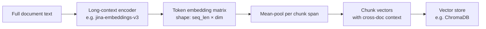

# Late Chunking

Late chunking inverts the usual "split then embed" pipeline: you embed the entire document first with a long-context model, then carve the resulting token-level embeddings into chunk vectors — so every chunk carries cross-document context that naive chunking permanently discards.

## What you'll learn

- Why naive chunk-then-embed loses inter-chunk context
- How late chunking preserves that context via token-level pooling
- A runnable local-first sketch with `sentence-transformers`
- When late chunking beats naive approaches — and when it does not
- How it compares to ColBERT-style late interaction

---

## The problem with naive chunking

In the standard pipeline you split a document into chunks, then embed each chunk independently. That independence is the bug.

Consider a document that opens with *"Berlin is the capital of Germany"* and later has a chunk that says only *"the city hosted the summit."* Embedded in isolation, *"the city"* floats in generic semantic space. The embedding model has no way to resolve the pronoun — it never saw *"Berlin"*.

!!! note "Concretely"
    On a retrieval benchmark the naive approach gave a cosine similarity of roughly **0.75** for a cross-chunk reference; late chunking raised it to roughly **0.85** by retaining the full-document token context. (Source: [Weaviate late-chunking writeup](https://weaviate.io/blog/late-chunking); numbers are illustrative of the technique, not a controlled benchmark.)

See [../foundations/chunking.md](../foundations/chunking.md) for a refresher on splitting strategies and [../foundations/retrieval.md](../foundations/retrieval.md) for how chunk quality affects recall.

---

## How late chunking works



The key insight is **step D**: rather than re-running the encoder on each chunk, you run it **once** on the whole document, then slice the resulting token embeddings by chunk boundary and mean-pool each slice. Because the transformer's attention layers processed all tokens together, each token embedding already encodes context from the rest of the document.

Steps in plain English:

1. Choose a long-context embedding model (≥8 k token window).
2. Tokenise the full document and record which token offsets map to which chunk.
3. Run one forward pass → token embedding matrix `[T × D]`.
4. For each chunk span `[start, end]`, mean-pool `embeddings[start:end]` → one `[D]` vector.
5. Store those vectors in your vector database alongside the original chunk text.

---

## Local-first implementation sketch

The snippet below uses [`sentence-transformers`](../sdks/sentence-transformers.md) with `jinaai/jina-embeddings-v3`, a freely available long-context model that runs on CPU. Swap in any model with a long enough context window.

```python
from sentence_transformers import SentenceTransformer
import chromadb
import numpy as np

# ----- 1. Load a long-context embedding model -----
model = SentenceTransformer(
    "jinaai/jina-embeddings-v3",
    trust_remote_code=True,
)

# ----- 2. Your document -----
document = """
Berlin is the capital of Germany. It is known for its vibrant arts scene.
The city hosted a major international summit in 2024.
Delegates from forty nations attended the event.
"""

# ----- 3. Define chunk boundaries (sentence-level here) -----
import re
sentences = [s.strip() for s in re.split(r"(?<=[.!?])\s+", document.strip()) if s]

# ----- 4. Tokenise the whole document once -----
tokenised = model.tokenizer(
    document,
    return_offsets_mapping=True,
    return_tensors="pt",
    truncation=True,
    max_length=model.max_seq_length,
)
offset_mapping = tokenised["offset_mapping"][0].tolist()  # [(char_start, char_end), ...]

# ----- 5. One forward pass → token embeddings -----
with __import__("torch").no_grad():
    outputs = model._first_module().auto_model(
        input_ids=tokenised["input_ids"],
        attention_mask=tokenised["attention_mask"],
        output_hidden_states=True,
    )
token_embeddings = outputs.last_hidden_state[0].numpy()  # shape (T, D)

# ----- 6. Map each chunk to its token span, then mean-pool -----
def char_span_to_token_span(char_start, char_end, offset_mapping):
    starts, ends = [], []
    for i, (cs, ce) in enumerate(offset_mapping):
        if ce > char_start and cs < char_end:
            starts.append(i)
            ends.append(i)
    return (min(starts), max(ends) + 1) if starts else (0, 1)

chunk_vectors = []
char_cursor = 0
for sentence in sentences:
    char_start = document.find(sentence, char_cursor)
    char_end = char_start + len(sentence)
    t_start, t_end = char_span_to_token_span(char_start, char_end, offset_mapping)
    vec = token_embeddings[t_start:t_end].mean(axis=0)
    chunk_vectors.append(vec)
    char_cursor = char_end

# ----- 7. Store in ChromaDB -----
client = chromadb.Client()
collection = client.get_or_create_collection("late_chunking_demo")
collection.add(
    ids=[f"chunk_{i}" for i in range(len(sentences))],
    embeddings=[v.tolist() for v in chunk_vectors],
    documents=sentences,
)

# ----- 8. Query -----
results = collection.query(
    query_texts=["What city hosted the summit?"],
    n_results=2,
)
print(results["documents"])
```

!!! tip "Model choice"
    Any model with a token window long enough to hold your document works. `jinaai/jina-embeddings-v3` (8 192 tokens), `nomic-embed-text-v1.5` (8 192 tokens), and `mixedbread-ai/mxbai-embed-large-v1` are all available on HuggingFace and run locally. For very long documents (legal, research papers) consider `jina-embeddings-v2-base-en` (up to ~8 k tokens) or a model specifically fine-tuned for long context.

!!! warning "Memory ceiling"
    A single forward pass over a 6 000-token document with a 768-dim model produces a `(6000 × 768)` float32 matrix — about **18 MB per document**. Batch carefully if you're indexing thousands of documents on a laptop.

---

## Late chunking vs ColBERT late interaction

These are two different uses of the word "late":

| Aspect | Late chunking | ColBERT late interaction |
|---|---|---|
| **What is "late"** | Splitting happens after encoding | Token-level matching between query and doc happens at retrieval time |
| **Storage** | One vector per chunk — same as dense retrieval | One vector **per token** in every stored document |
| **Storage overhead** | ~1× dense baseline | ~500× dense baseline (approximate, [per Weaviate](https://weaviate.io/blog/late-chunking)) |
| **Retrieval mechanism** | ANN search on chunk vectors | MaxSim across query-token × doc-token matrix |
| **Offline index** | Yes — pre-computed vectors | Partially — token embeddings stored, but interaction is at query time |
| **Local feasibility** | Yes — modest RAM | Challenging at scale; practical for small corpora |
| **Best for** | Preserving cross-sentence context cheaply | Fine-grained phrase-level matching |

!!! note "Storage figure"
    The ~1/500th storage advantage of late chunking over ColBERT is an approximation from [Weaviate's analysis](https://weaviate.io/blog/late-chunking). Actual ratios depend on average document length, chunk size, and embedding dimension.

---

## When to use late chunking

**Use it when:**

- Your documents contain co-references across chunks (pronouns, abbreviations, entity aliases).
- Passage-level documents (news articles, research paper sections) are being split into ≤4 sentence chunks.
- You already have or can afford a long-context embedding model locally.
- Your corpus is small to medium (fitting comfortably in one forward pass per document).

**Consider alternatives when:**

- Documents exceed the model's context window — late chunking cannot help beyond that boundary; consider hierarchical chunking or sliding-window overlap instead.
- You need sub-word phrase matching — ColBERT late interaction may give sharper precision.
- You're doing purely keyword-based retrieval — pair with BM25/hybrid instead.

See [reranking.md](reranking.md) for how to layer a cross-encoder on top of late-chunking retrieval, and [retrieval-techniques-compared.md](retrieval-techniques-compared.md) for a side-by-side of all major retrieval strategies.

---

## Trade-offs at a glance

| Consideration | Impact |
|---|---|
| Indexing speed | Slower — one long forward pass per doc instead of per chunk |
| Retrieval latency | Same as dense — no runtime overhead |
| Embedding model requirement | Must support long context (≥ document length in tokens) |
| Chunk coherence | Improved for co-references; no change for self-contained chunks |
| Integration effort | Medium — requires token-level pooling logic (see sketch above) |

---

## Next steps

- Read [../foundations/chunking.md](../foundations/chunking.md) to understand the baseline splitting strategies late chunking improves upon.
- Combine with a cross-encoder reranker: [reranking.md](reranking.md).
- Compare all retrieval strategies side by side: [retrieval-techniques-compared.md](retrieval-techniques-compared.md).
- Evaluate whether late chunking helps your specific corpus: [evaluation.md](evaluation.md).
