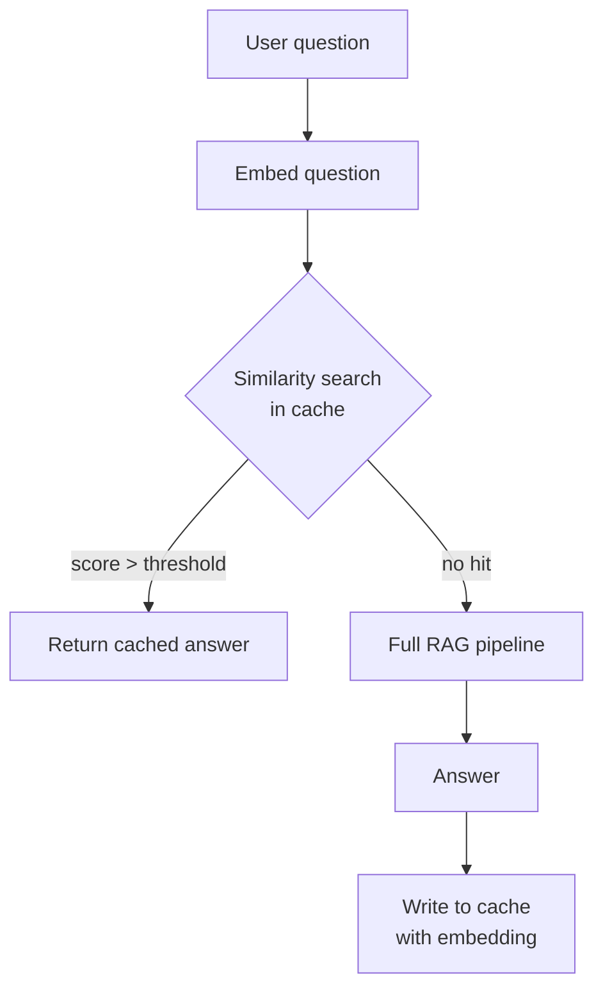
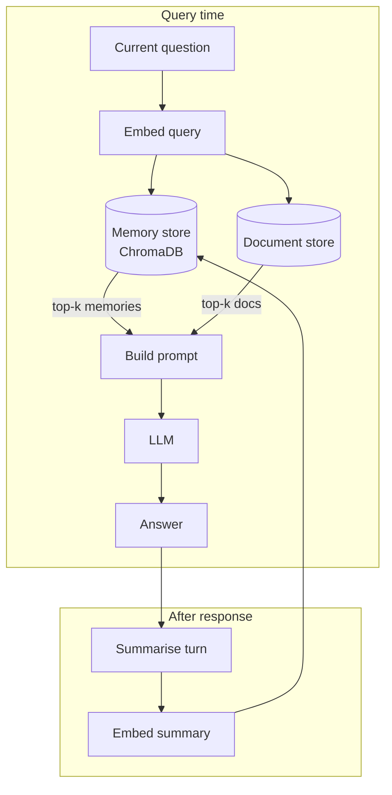
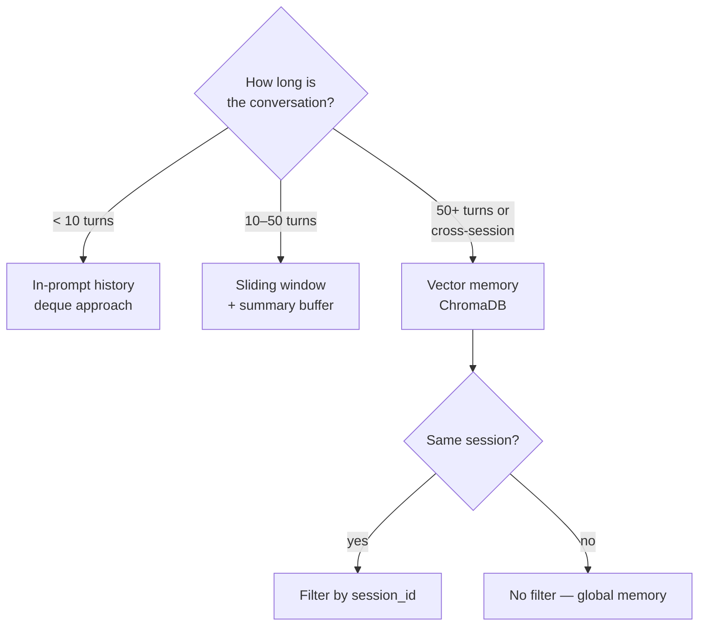

# Long Context, Caching, and Memory

Three intertwined topics that shape how your RAG system handles scale, cost, and continuity: long-context LLMs vs retrieval, semantic caching to cut latency, and conversational memory for multi-turn chat.

## What you'll learn

- When a large context window is a genuine alternative to RAG — and when it isn't
- How semantic caching works and the pitfalls to avoid
- The difference between short-term chat history and long-term vector memory
- Simple local implementations for each pattern
- Honest trade-offs at each layer

---

## Part 1 — Long-context LLMs vs RAG

### The temptation

Models with 128 K, 200 K, or even 1 M token context windows invite an obvious question: why bother with a retrieval pipeline? Just stuff everything into the context and let the model figure it out.

For some use cases, this is genuinely the right call.

### When a big context window replaces retrieval

| Scenario | Why long-context wins |
|---|---|
| Small, stable corpora (<100 pages) | Fits in context; no indexing overhead |
| One-off analysis tasks | No retrieval pipeline to maintain |
| High coherence required | No risk of retrieving the wrong chunk |
| Rapid prototyping | Faster to implement |

### When RAG still wins

| Concern | Why RAG wins |
|---|---|
| Cost | Sending 200 K tokens per query is expensive with hosted APIs; local models slow down linearly with context |
| "Lost in the middle" | LLMs reliably attend to the start and end of a long context but miss information buried in the middle [(Liu et al., 2023)](https://arxiv.org/abs/2307.03172) |
| Freshness | Retrieval can index new documents without re-sending the entire corpus |
| Dynamic corpora | Retrieval scales to millions of documents; long context does not |
| Latency | Time-to-first-token grows with prompt length; retrieval adds milliseconds not seconds |
| Privacy / data residency | Sending your entire corpus to an API in one request is a bigger surface area |

```mermaid
quadrantChart
    title Long Context vs RAG — rough fit
    x-axis Small corpus --> Large corpus
    y-axis Stable / infrequent updates --> Rapidly changing
    quadrant-1 RAG (fresh + large)
    quadrant-2 RAG or hybrid
    quadrant-3 Long context fine
    quadrant-4 Long context or periodic re-index
```

!!! note "Not \"RAG is dead\""
    Every few months a headline appears claiming long-context models make RAG obsolete. They don't — they change the trade-off curve. For large, dynamic, cost-sensitive deployments, retrieval remains the right architecture. For small, static corpora where you control the model, long context is a legitimate shortcut.

### Practical heuristic

```
corpus tokens < 50 K  AND  updates < once/day  AND  cost is not a constraint
    → try long context first
otherwise
    → use RAG
```

For local inference with Ollama, "cost" includes compute time. A 7 B model running 128 K tokens locally will be **very slow**. Retrieval keeps your prompts short.

See [Retrieval Foundations](../foundations/retrieval.md) for a deeper look at retrieval mechanics.

---

## Part 2 — Semantic Caching

### What it is

Semantic caching stores question-answer pairs and, on each new query, checks whether an **embedding-similar** question has been answered before. If so, return the cached answer without calling the LLM.



### Why bother?

- Cut LLM call latency from seconds to milliseconds for repeated question patterns
- Reduce costs when using hosted APIs
- Useful for FAQ-style workloads where many users ask similar questions

### Simple local implementation

```python
import chromadb
from sentence_transformers import SentenceTransformer
import hashlib, time

embedder = SentenceTransformer("all-MiniLM-L6-v2")
client = chromadb.PersistentClient(path="./semantic_cache")
cache = client.get_or_create_collection(
    name="answer_cache",
    metadata={"hnsw:space": "cosine"},
)

SIMILARITY_THRESHOLD = 0.92   # tune this carefully — see pitfalls below
CACHE_TTL_SECONDS = 3600      # 1 hour; set to None to disable expiry

def cache_lookup(question: str) -> str | None:
    """Return a cached answer if a similar question was answered recently."""
    embedding = embedder.encode([question]).tolist()[0]
    results = cache.query(query_embeddings=[embedding], n_results=1)
    if not results["ids"][0]:
        return None
    distance = results["distances"][0][0]
    similarity = 1 - distance  # cosine distance → similarity
    if similarity < SIMILARITY_THRESHOLD:
        return None
    meta = results["metadatas"][0][0]
    # Check TTL
    if CACHE_TTL_SECONDS is not None:
        age = time.time() - meta.get("cached_at", 0)
        if age > CACHE_TTL_SECONDS:
            return None
    return meta["answer"]

def cache_store(question: str, answer: str) -> None:
    """Store a question-answer pair in the cache."""
    embedding = embedder.encode([question]).tolist()[0]
    uid = hashlib.md5(question.encode()).hexdigest()
    cache.upsert(
        ids=[uid],
        embeddings=[embedding],
        metadatas=[{"question": question, "answer": answer, "cached_at": time.time()}],
    )

def rag_with_cache(question: str, rag_fn) -> str:
    """Wrap any RAG function with semantic caching."""
    cached = cache_lookup(question)
    if cached:
        print("[cache hit]")
        return cached
    answer = rag_fn(question)
    cache_store(question, answer)
    return answer
```

### Pitfalls

!!! warning "Tune the threshold carefully"
    A threshold that's too low causes **over-eager hits**: "What is the capital of France?" and "What is the largest city in France?" might score 0.89 similarity but have different correct answers. A threshold too high defeats the purpose of caching.

    Start at 0.95 and lower only if hit rates are too low. Validate by sampling cache hits and checking answer correctness.

!!! warning "Stale answers"
    Cached answers reflect the state of your knowledge base at cache time. If your documents update, cached answers may be wrong. Options:
    - Use a short TTL (1 hour, 1 day)
    - Invalidate the entire cache on corpus updates
    - Tag cached answers with a corpus version hash

!!! warning "Don't cache volatile queries"
    "What time is it?" or "What happened today?" should never be cached. Add a classifier or blocklist for time-sensitive question patterns.

---

## Part 3 — Conversational Memory

### The problem

A stateless RAG pipeline answers each question independently. In a multi-turn chat, users expect context continuity:

> User: "Tell me about transformer architecture."  
> RAG: *[good answer]*  
> User: "How does it compare to RNNs?"  
> RAG: *[has no idea "it" refers to transformers]*

There are two layers to solve: **short-term history** (the current session) and **long-term memory** (across sessions or very long conversations).

---

### Short-term: chat history in the prompt

The simplest approach: pass recent turns directly in the prompt. This works well for conversations up to ~10 turns.

```python
from collections import deque

class ChatHistory:
    def __init__(self, max_turns: int = 6):
        self.turns: deque[dict] = deque(maxlen=max_turns)

    def add(self, role: str, content: str) -> None:
        self.turns.append({"role": role, "content": content})

    def format_for_prompt(self) -> str:
        lines = []
        for turn in self.turns:
            prefix = "User" if turn["role"] == "user" else "Assistant"
            lines.append(f"{prefix}: {turn['content']}")
        return "\n".join(lines)

def rag_with_history(question: str, history: ChatHistory, retriever_fn, llm_fn) -> str:
    context_chunks = retriever_fn(question)
    context = "\n\n".join(context_chunks)
    conversation = history.format_for_prompt()

    prompt = f"""Use the retrieved context to answer the user's question.
Take into account the conversation history below.

Context:
{context}

Conversation history:
{conversation}

User: {question}
Assistant:"""

    answer = llm_fn(prompt)
    history.add("user", question)
    history.add("assistant", answer)
    return answer
```

See [Streamlit Chat App Tutorial](../tutorials/03-streamlit-chat-app.md) for a full UI example.

---

### Long-term: vector memory

For long-running agents or sessions that span many hours or many conversations, in-prompt history becomes unwieldy. The solution is to store past exchanges as embeddings and **retrieve relevant memories** alongside the current query.



```python
import chromadb
from sentence_transformers import SentenceTransformer
import time, uuid

embedder = SentenceTransformer("all-MiniLM-L6-v2")
mem_client = chromadb.PersistentClient(path="./memory_store")
memory = mem_client.get_or_create_collection("long_term_memory")

def store_memory(user_msg: str, assistant_msg: str, session_id: str) -> None:
    """Store a conversation turn as a memory entry."""
    text = f"User asked: {user_msg}\nAssistant answered: {assistant_msg}"
    embedding = embedder.encode([text]).tolist()[0]
    memory.add(
        ids=[str(uuid.uuid4())],
        embeddings=[embedding],
        documents=[text],
        metadatas=[{"session_id": session_id, "ts": time.time()}],
    )

def retrieve_memories(question: str, top_k: int = 3, session_id: str | None = None) -> list[str]:
    """Retrieve past turns relevant to the current question."""
    embedding = embedder.encode([question]).tolist()[0]
    where = {"session_id": session_id} if session_id else None
    results = memory.query(
        query_embeddings=[embedding],
        n_results=top_k,
        where=where,
    )
    return results["documents"][0] if results["documents"] else []
```

!!! tip "Summarise before storing"
    Storing raw message pairs can get noisy. Summarise long turns with the LLM before embedding — this improves retrieval precision and saves storage.

---

### Choosing your memory strategy



| Strategy | When to use | Downside |
|---|---|---|
| In-prompt history | Short sessions, simple Q&A | Prompt grows with conversation |
| Sliding window | Medium sessions | Old context lost abruptly |
| Summary buffer | Medium sessions with LLM | Extra LLM call per turn |
| Vector memory | Long sessions, multi-session agents | Retrieval can miss if embedding quality is low |

---

## Putting it together: a cached, memory-aware RAG loop

```python
import httpx
from sentence_transformers import SentenceTransformer

# Assumes you have retrieve_docs(), cache_lookup(), cache_store(),
# store_memory(), retrieve_memories() from the snippets above.

embedder = SentenceTransformer("all-MiniLM-L6-v2")
SESSION_ID = "user-123"

def full_rag(question: str) -> str:
    # 1. Semantic cache check
    cached = cache_lookup(question)
    if cached:
        return cached

    # 2. Retrieve relevant memories
    memories = retrieve_memories(question, top_k=2, session_id=SESSION_ID)
    memory_block = "\n".join(memories)

    # 3. Retrieve documents (your existing retriever)
    docs = retrieve_docs(question, top_k=4)
    doc_block = "\n\n".join(docs)

    # 4. Build prompt
    prompt = f"""Relevant past context from memory:
{memory_block}

Retrieved documents:
{doc_block}

Question: {question}
Answer:"""

    # 5. Call Ollama
    resp = httpx.post(
        "http://localhost:11434/api/generate",
        json={"model": "llama3", "prompt": prompt, "stream": False},
        timeout=90,
    )
    answer = resp.json()["response"].strip()

    # 6. Cache and store memory
    cache_store(question, answer)
    store_memory(question, answer, session_id=SESSION_ID)

    return answer
```

---

## Next steps

- Read [Retrieval Foundations](../foundations/retrieval.md) to understand the mechanics underpinning both RAG and memory retrieval
- See [Production](production.md) for cache invalidation strategies, connection pooling, and monitoring
- Build a chat UI to see memory in action: [Streamlit Chat App Tutorial](../tutorials/03-streamlit-chat-app.md)
- Explore [Evaluation](evaluation.md) to measure whether your caching threshold is causing incorrect hits
- Check [Agentic RAG](agentic-rag.md) for memory patterns in agent loops
