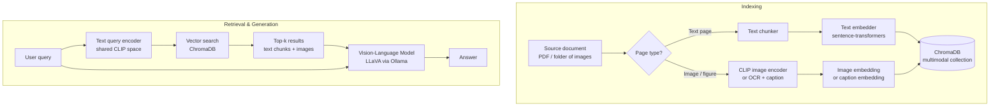

# Multimodal RAG

Extend your retrieval pipeline beyond plain text by indexing images, figures, screenshots, and mixed-content documents — then retrieve and reason over them with vision-language models.

## What you'll learn

- How multimodal embeddings (CLIP and friends) represent images and text in a shared vector space
- The difference between OCR-based and native vision approaches for PDF figures and screenshots
- How to build a local multimodal indexing pipeline with `sentence-transformers` and ChromaDB
- Where vision-language models like LLaVA (via Ollama) fit into generation
- Current maturity limitations you should know before building for production

---

## Why go multimodal?

Real-world documents are rarely text-only. Annual reports embed charts. Technical manuals contain diagrams. Product catalogues are mostly images. E-commerce search is inherently visual. A text-only RAG pipeline silently drops all of that signal.

Multimodal RAG bridges the gap by embedding both images and text into a **shared vector space** so that a natural-language query like *"show me the revenue breakdown chart"* can surface the right figure even when no caption mentions those exact words.

!!! warning "Maturity caveat"
    Multimodal RAG is evolving fast but is **not yet plug-and-play**. Local open-weight vision-language models (LLaVA, BakLLaVA, Moondream) are capable but lag behind hosted APIs on complex reasoning. Expect to iterate on your pipeline and to encounter edge cases that pure-text pipelines handle more reliably.

---

## Two broad strategies

### Strategy 1 — OCR / caption-then-embed

Extract text from images (OCR), or generate a caption with a vision model, then embed that text with your standard text embedder.

**Pros:** Works with any existing text retriever; no special multimodal embedder needed.  
**Cons:** Loses visual structure; OCR errors propagate; captions can hallucinate or miss detail.

### Strategy 2 — Multimodal embeddings

Embed images *and* queries directly into the same vector space using a model like CLIP. Retrieval happens over image embeddings; a vision-language model handles generation.

**Pros:** Preserves visual semantics; no OCR step; better for non-textual images (charts, photos).  
**Cons:** Requires a multimodal embedder; CLIP-family models have a short effective "context" for images; fewer locally-runnable options.

In practice many production pipelines **combine both**: CLIP for initial retrieval, then a vision-language model for generation.

---

## Conceptual pipeline



---

## Local tooling

| Role | Local option | Notes |
|---|---|---|
| Multimodal embeddings | `clip-ViT-B-32` via `sentence-transformers` | Good baseline; 512-dim |
| OCR | `pytesseract`, `easyocr` | Free, CPU-friendly |
| Vision-language model | LLaVA 1.6 via Ollama | Requires ~8 GB VRAM or RAM |
| Vector store | ChromaDB | Stores both text and image embeddings |
| PDF extraction | `pymupdf` (fitz) | Extracts pages as images or text |

See [Embedding Models](../tools/embedding-models.md) and [ChromaDB](../tools/chromadb.md) for setup details.

---

## Hands-on: indexing a PDF with figures

### 1. Extract pages as images

```python
import fitz  # pip install pymupdf
from pathlib import Path

def pdf_to_images(pdf_path: str, output_dir: str, dpi: int = 150) -> list[str]:
    """Render each PDF page to a PNG file."""
    doc = fitz.open(pdf_path)
    out = Path(output_dir)
    out.mkdir(parents=True, exist_ok=True)
    paths = []
    for i, page in enumerate(doc):
        mat = fitz.Matrix(dpi / 72, dpi / 72)
        pix = page.get_pixmap(matrix=mat)
        p = out / f"page_{i:04d}.png"
        pix.save(str(p))
        paths.append(str(p))
    return paths
```

### 2. Embed images with CLIP

```python
from sentence_transformers import SentenceTransformer
from PIL import Image

# Load a CLIP model that encodes both images and text
clip_model = SentenceTransformer("clip-ViT-B-32")

def embed_images(image_paths: list[str]) -> list[list[float]]:
    images = [Image.open(p) for p in image_paths]
    embeddings = clip_model.encode(images, convert_to_numpy=True)
    return embeddings.tolist()
```

!!! note
    `sentence-transformers` CLIP models encode text and images **in the same space**, so you can query with a text string and retrieve images — no separate text embedder needed for this collection.

### 3. Store in ChromaDB

```python
import chromadb

client = chromadb.PersistentClient(path="./chroma_mm")
collection = client.get_or_create_collection(
    name="pdf_pages",
    metadata={"hnsw:space": "cosine"},
)

def index_images(image_paths: list[str], embeddings: list[list[float]]) -> None:
    collection.add(
        ids=[f"page_{i}" for i in range(len(image_paths))],
        embeddings=embeddings,
        metadatas=[{"path": p} for p in image_paths],
    )
```

### 4. Query and generate with LLaVA

```python
import base64, httpx

def encode_image_b64(path: str) -> str:
    with open(path, "rb") as f:
        return base64.b64encode(f.read()).decode()

def query_multimodal(user_question: str, top_k: int = 3) -> str:
    # Embed the query text using CLIP
    query_embedding = clip_model.encode([user_question]).tolist()[0]

    # Retrieve top-k matching pages
    results = collection.query(
        query_embeddings=[query_embedding],
        n_results=top_k,
    )
    image_paths = [m["path"] for m in results["metadatas"][0]]

    # Build a multi-image prompt for LLaVA via Ollama
    images_b64 = [encode_image_b64(p) for p in image_paths]

    payload = {
        "model": "llava",
        "prompt": f"Using the provided page images, answer: {user_question}",
        "images": images_b64,
        "stream": False,
    }
    resp = httpx.post("http://localhost:11434/api/generate", json=payload, timeout=120)
    resp.raise_for_status()
    return resp.json()["response"]

# Example
answer = query_multimodal("What does the revenue chart on page 3 show?")
print(answer)
```

!!! tip "Pull LLaVA first"
    ```bash
    ollama pull llava
    ```
    LLaVA 1.6 (7 B) runs on ~8 GB RAM/VRAM. For lighter hardware try `moondream` (~1.8 B).

---

## OCR as a fallback

When images contain dense text (scanned documents, slides), a vision model may miss detail. OCR extracts the text reliably, which you can then embed with a standard text encoder.

```python
import pytesseract  # pip install pytesseract
from PIL import Image

def ocr_page(image_path: str) -> str:
    img = Image.open(image_path)
    return pytesseract.image_to_string(img)
```

A practical heuristic: if OCR returns more than ~50 words for a page, treat it as a text chunk; otherwise fall back to vision embedding. See [Document Loaders](../building-blocks/document-loaders.md) for how to integrate this into a loader.

---

## Use cases

| Use case | Recommended approach |
|---|---|
| PDFs with mixed text and charts | CLIP indexing + LLaVA generation |
| Scanned documents | OCR → text embed |
| Product image search | CLIP embeddings only (no LLM needed) |
| Technical diagrams / schematics | CLIP + vision-LLM description |
| Screenshots / UI docs | OCR + CLIP hybrid |

---

## Limitations to know

!!! warning "Know these before shipping"
    - **CLIP context is shallow.** CLIP ViT-B/32 was trained on image-caption pairs, not detailed documents. It excels at coarse-grained visual similarity but can miss fine-grained chart detail.
    - **LLaVA hallucinates numbers.** Vision-language models are prone to misreading exact values from charts. Post-process critical figures.
    - **Latency is high.** Encoding images + calling a vision model locally is slow. Plan for multi-second response times per query.
    - **No streaming image tokens locally.** Ollama's LLaVA integration supports streaming text but image ingestion adds a fixed overhead.
    - **Multi-image prompts are experimental.** Passing many images to LLaVA can degrade quality. Keep `top_k` low (2–3).

---

## Next steps

- Work through [PDF Q&A Tutorial](../tutorials/04-pdf-qa.md) for a full runnable PDF pipeline (text-first, extendable to multimodal)
- Deepen your understanding of embeddings at [Embeddings Foundations](../foundations/embeddings.md)
- Explore [Reranking](reranking.md) to post-filter retrieved pages by relevance before sending to the vision model
- Check [Hybrid Search](hybrid-search.md) for combining CLIP similarity with keyword scores on captions
- See [Agentic RAG](agentic-rag.md) for pipelines that decide when to invoke vision vs. text retrieval
