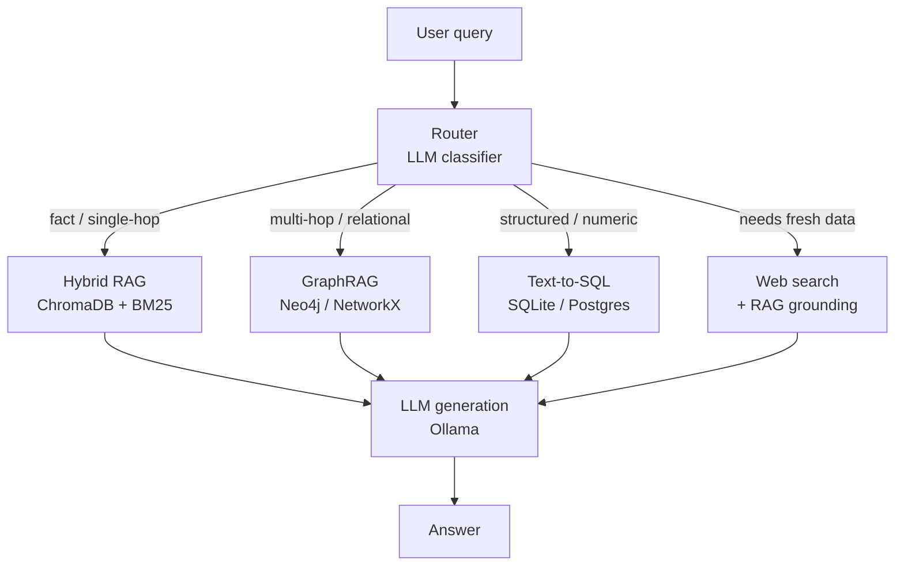
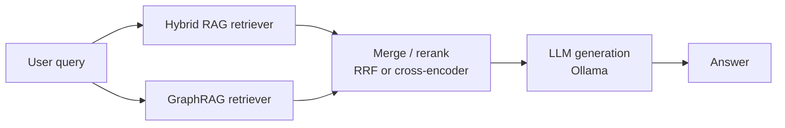

# Query Routing

Not all questions are the same shape. A query asking for a single precise fact and a query asking how three events are causally connected are retrieval problems that favour different architectures. Query routing lets your system pick — or combine — the right retrieval path per query, rather than applying one strategy universally.

## What you'll learn

- Why query type determines the best retrieval strategy
- When standard dense/hybrid RAG wins and when GraphRAG wins
- How to build a lightweight Ollama-powered LLM classifier that routes queries
- The parallel "run both, merge" integration pattern
- Practical trade-offs and when routing overhead is not worth it

---

## Why routing matters

Research on hybrid RAG vs graph-augmented retrieval ([arXiv 2502.11371](https://arxiv.org/abs/2502.11371)) shows that **neither architecture dominates across all query types**:

- **Standard RAG** (dense + BM25 hybrid) wins on single-hop, fact-centric queries where precise chunk retrieval matters most.
- **GraphRAG variants** (HippoRAG2, Community-GraphRAG) win on multi-hop reasoning queries that require traversing relationships between entities.

The same paper found that the best systems either **select** a strategy per query (routing) or **integrate** both in parallel (ensemble).

!!! note "Single-strategy ceiling"
    Picking one retrieval strategy for everything means you're either leaving multi-hop accuracy on the table (pure dense) or paying graph-construction cost for queries that never need it (pure GraphRAG). Routing breaks that ceiling.

---

## Query taxonomy

Before building a router, you need a taxonomy. A practical three-way split for most RAG systems:

| Query type | Characteristics | Best strategy |
|---|---|---|
| **Fact / single-hop** | One entity, one attribute. "What is the capital of Germany?" | Standard dense/hybrid RAG |
| **Relational / multi-hop** | Requires connecting ≥2 entities or traversing relationships. "Which papers cited by Author X were later cited by Author Y?" | GraphRAG |
| **Structured / SQL** | Numerical filters, aggregations, joins over tabular data. "Which customers spent > $10 000 last quarter?" | RAG-over-SQL or direct SQL |
| **Open / web** | Requires up-to-date or out-of-corpus information. "What happened in the news today?" | Web search + RAG |

See [graph-rag.md](graph-rag.md), [agentic-rag.md](agentic-rag.md), and [rag-over-sql.md](rag-over-sql.md) for deep dives into the non-standard branches.

---

## Architecture: Selection routing



---

## Building a local LLM router with Ollama

The router is a small LLM call that classifies the query before retrieval. Because classification is cheap (a few hundred tokens), even a small model like `llama3.2:3b` works well here.

```python
import httpx
import json

OLLAMA_URL = "http://localhost:11434/api/generate"
ROUTER_MODEL = "llama3.2:3b"  # tiny model is fine for classification

ROUTE_LABELS = ["fact", "multi_hop", "sql", "web"]

SYSTEM_PROMPT = """You are a query classifier for a RAG system.
Classify the user query into exactly one of these categories:

- fact        : single-hop factual lookup, one entity/attribute
- multi_hop   : requires connecting multiple entities or reasoning chains
- sql         : needs numeric aggregation, filters, or joins over tabular data
- web         : requires current events or information outside the document corpus

Respond with a JSON object: {"route": "<label>", "reason": "<one sentence>"}
No other text."""

def classify_query(query: str) -> dict:
    payload = {
        "model": ROUTER_MODEL,
        "prompt": f"Query: {query}",
        "system": SYSTEM_PROMPT,
        "stream": False,
        "format": "json",
    }
    resp = httpx.post(OLLAMA_URL, json=payload, timeout=30)
    resp.raise_for_status()
    return json.loads(resp.json()["response"])

# --- Stub retrieval functions (replace with your real implementations) ---

def retrieve_hybrid(query: str) -> list[str]:
    """Dense + BM25 hybrid retrieval from ChromaDB."""
    return [f"[Hybrid result for: {query}]"]

def retrieve_graph(query: str) -> list[str]:
    """Graph traversal retrieval."""
    return [f"[Graph result for: {query}]"]

def retrieve_sql(query: str) -> list[str]:
    """Text-to-SQL retrieval."""
    return [f"[SQL result for: {query}]"]

def retrieve_web(query: str) -> list[str]:
    """Web search retrieval."""
    return [f"[Web result for: {query}]"]

ROUTE_MAP = {
    "fact":      retrieve_hybrid,
    "multi_hop": retrieve_graph,
    "sql":       retrieve_sql,
    "web":       retrieve_web,
}

def routed_retrieve(query: str) -> list[str]:
    classification = classify_query(query)
    route = classification.get("route", "fact")
    print(f"Route: {route} | Reason: {classification.get('reason', '')}")
    retriever = ROUTE_MAP.get(route, retrieve_hybrid)
    return retriever(query)

# --- Example ---
if __name__ == "__main__":
    queries = [
        "What is the boiling point of ethanol?",
        "Which researchers cited both Smith 2020 and Jones 2021?",
        "How many orders exceeded $5000 in Q1 2024?",
        "What AI announcements happened this week?",
    ]
    for q in queries:
        docs = routed_retrieve(q)
        print(f"Q: {q}\nDocs: {docs}\n")
```

!!! tip "Prompt engineering the router"
    Few-shot examples in the system prompt dramatically improve classification accuracy. Add 2–3 examples of each route label with their query. A structured JSON response format (`"format": "json"` in Ollama) prevents the model from wrapping the answer in prose.

!!! warning "Router latency"
    Every query pays one extra LLM call. With `llama3.2:3b` on a modern CPU this is typically 200–800 ms. If latency is critical, consider a fine-tuned embedding classifier (e.g. a `sentence-transformers` model trained to predict route labels) — near-zero latency at the cost of a training step.

---

## Architecture: Integration (parallel run-both)

When misclassification risk is high — or when you cannot tell in advance which strategy will win — run both paths in parallel and merge results.



```python
import asyncio
import httpx

async def retrieve_hybrid_async(query: str) -> list[str]:
    # Replace with real async ChromaDB call
    await asyncio.sleep(0)
    return [f"[Hybrid] {query}"]

async def retrieve_graph_async(query: str) -> list[str]:
    await asyncio.sleep(0)
    return [f"[Graph] {query}"]

def reciprocal_rank_fusion(result_lists: list[list[str]], k: int = 60) -> list[str]:
    scores: dict[str, float] = {}
    for results in result_lists:
        for rank, doc in enumerate(results, start=1):
            scores[doc] = scores.get(doc, 0.0) + 1.0 / (k + rank)
    return sorted(scores, key=scores.get, reverse=True)

async def integrated_retrieve(query: str) -> list[str]:
    hybrid_docs, graph_docs = await asyncio.gather(
        retrieve_hybrid_async(query),
        retrieve_graph_async(query),
    )
    merged = reciprocal_rank_fusion([hybrid_docs, graph_docs])
    return merged[:5]

if __name__ == "__main__":
    results = asyncio.run(integrated_retrieve("How do transformer attention heads relate to BERT fine-tuning?"))
    print(results)
```

!!! note "RRF vs cross-encoder merge"
    RRF (Reciprocal Rank Fusion) is fast and parameter-free. A cross-encoder reranker gives higher quality at the cost of an additional inference step. See [reranking.md](reranking.md) for a local cross-encoder setup with `cross-encoder/ms-marco-MiniLM-L-6-v2`.

---

## Choosing between Selection and Integration

| Criterion | Selection (route to one) | Integration (run both) |
|---|---|---|
| Latency | Lower — one retrieval path | Higher — two paths in parallel, then merge |
| Accuracy when query type is clear | High | Marginal gain over selection |
| Accuracy on ambiguous queries | Risk of wrong route | More robust |
| Cost | Lower (one retriever) | Higher (two retrievers + merge) |
| Recommended when | Query types are distinct and classifiable | Queries are mixed or stakes are high |

---

## Routing to web search and SQL

For web queries, replace the stub above with a search API call (SerpAPI, Tavily, or DuckDuckGo's unofficial API). Ground the LLM generation on those snippets before answering.

For SQL, the route feeds a text-to-SQL chain rather than a vector retriever. See [rag-over-sql.md](rag-over-sql.md) for a full local implementation with SQLite.

---

## Next steps

- Deep dive into the graph retrieval branch: [graph-rag.md](graph-rag.md).
- Build an agent that decides dynamically whether to retrieve, query a tool, or ask for clarification: [agentic-rag.md](agentic-rag.md).
- Add SQL as a first-class retrieval route: [rag-over-sql.md](rag-over-sql.md).
- Compare all retrieval strategies in one table: [retrieval-techniques-compared.md](retrieval-techniques-compared.md).
