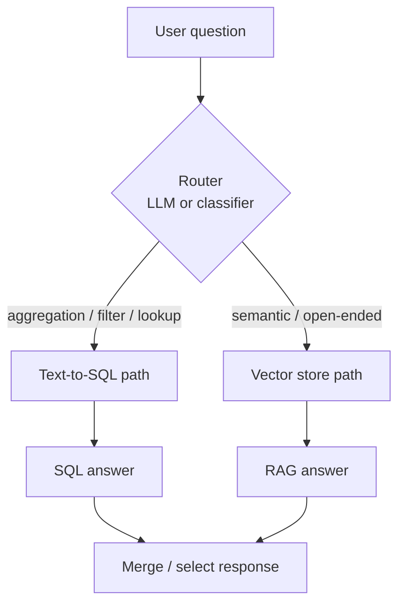

# RAG over SQL (Structured Data)

Answer natural-language questions over relational tables by having an LLM generate SQL — and learn when this beats vector retrieval, when it doesn't, and how to combine both safely.

## What you'll learn

- The text-to-SQL pattern: how an LLM turns a user question into a valid SQL query
- When to route queries to SQL vs. a vector store
- How to build a hybrid router for mixed structured/unstructured corpora
- Safety practices: read-only connections, parameterisation, schema injection
- A runnable local sketch with SQLite and Ollama

---

## The core idea

Vector search is great for *semantic* questions — "find documents about supply chain disruptions." But it struggles with *aggregation and factual* questions over structured data — "what was the average order value last month?" or "how many users signed up in Q1?"

Text-to-SQL flips the retrieval step: instead of embedding the query and searching vectors, the LLM reads your database schema and writes a SQL query that the database executes directly.


!!! note "Maturity caveat"
    Text-to-SQL with local open-weight models is **usable but imperfect**. On simple schemas and well-phrased questions, models like `llama3` or `mistral` via Ollama do well. Complex multi-join schemas, ambiguous column names, or dialect-specific syntax (window functions, CTEs) still trip them up. Test on your real schema before relying on this in production.

---

## SQL vs. vector retrieval — when to use which

| Signal | Prefer SQL | Prefer vector search |
|---|---|---|
| Data shape | Tables with typed columns | Documents, passages, notes |
| Query type | Aggregation, filtering, counting, exact lookup | Semantic similarity, fuzzy matching |
| Answer type | Numbers, rows, precise facts | Summaries, explanations |
| Freshness | Data changes constantly | Corpus is relatively stable |
| Schema | Stable, well-understood | Unstructured or semi-structured |

Many real corpora are **mixed**: a database of products (structured) plus a knowledge base of support articles (unstructured). That's where routing helps.

---

## Hybrid routing: SQL + vectors

See [Query Routing](query-routing.md) for the full pattern. The short version:



A simple router prompt:

```python
ROUTER_PROMPT = """
You are a routing classifier. Given a user question, decide whether it is:
- "sql": requires counting, aggregation, filtering by value, or an exact fact from a database
- "vector": requires understanding meaning, summarising documents, or semantic search

Question: {question}
Reply with exactly one word: sql or vector.
"""
```

---

## Safety first

Before writing a single line of text-to-SQL code, internalise these rules.

!!! danger "Never run generated SQL on a write-capable connection"
    An LLM can generate `DROP TABLE`, `DELETE`, or `UPDATE` statements — even from a well-intentioned prompt. Always connect with a **read-only** user or use `PRAGMA query_only = ON` for SQLite.

!!! warning "Never interpolate user input into SQL strings"
    Use parameterised queries or, for text-to-SQL, validate that the generated SQL only contains `SELECT` statements before executing.

Safety checklist:

- Connect read-only
- Validate: reject anything that isn't a `SELECT`
- Limit result rows (`LIMIT 100` appended if missing)
- Redact sensitive columns from the schema you show the LLM
- Log all generated queries for audit

---

## Runnable sketch: SQLite + Ollama

### Setup

```bash
pip install httpx
# SQLite is in Python's standard library — no install needed
# Ollama: https://ollama.com — then pull a model
ollama pull llama3
```

### Create a sample database

```python
import sqlite3

def create_sample_db(db_path: str = "sales.db") -> None:
    con = sqlite3.connect(db_path)
    con.executescript("""
        CREATE TABLE IF NOT EXISTS products (
            id INTEGER PRIMARY KEY,
            name TEXT NOT NULL,
            category TEXT,
            price REAL
        );
        CREATE TABLE IF NOT EXISTS orders (
            id INTEGER PRIMARY KEY,
            product_id INTEGER REFERENCES products(id),
            quantity INTEGER,
            order_date TEXT,   -- ISO-8601 date string
            customer TEXT
        );
        INSERT OR IGNORE INTO products VALUES
            (1,'Laptop','Electronics',999.99),
            (2,'Desk Chair','Furniture',249.50),
            (3,'USB Hub','Electronics',29.99),
            (4,'Standing Desk','Furniture',599.00);
        INSERT OR IGNORE INTO orders VALUES
            (1,1,2,'2024-01-15','alice'),
            (2,2,1,'2024-01-20','bob'),
            (3,3,5,'2024-02-01','alice'),
            (4,1,1,'2024-02-10','carol'),
            (5,4,1,'2024-02-14','bob');
    """)
    con.commit()
    con.close()

create_sample_db()
```

### Extract schema for the prompt

```python
import sqlite3

def get_schema(db_path: str) -> str:
    """Return a compact schema description safe to inject into a prompt."""
    con = sqlite3.connect(db_path)
    cur = con.cursor()
    cur.execute("SELECT name FROM sqlite_master WHERE type='table' ORDER BY name")
    tables = [row[0] for row in cur.fetchall()]
    lines = []
    for table in tables:
        cur.execute(f"PRAGMA table_info({table})")
        cols = cur.fetchall()
        col_defs = ", ".join(f"{c[1]} {c[2]}" for c in cols)
        lines.append(f"Table {table}({col_defs})")
    con.close()
    return "\n".join(lines)

schema = get_schema("sales.db")
print(schema)
# Table orders(id INTEGER, product_id INTEGER, quantity INTEGER, order_date TEXT, customer TEXT)
# Table products(id INTEGER, name TEXT, category TEXT, price REAL)
```

### Generate SQL with Ollama

```python
import httpx, re

SYSTEM_PROMPT = """You are a SQL expert. Given a SQLite schema and a user question, write a single valid SQLite SELECT query.
Return ONLY the SQL query — no explanation, no markdown, no code fences.
Never use INSERT, UPDATE, DELETE, DROP, or any DDL."""

def generate_sql(question: str, schema: str, model: str = "llama3") -> str:
    prompt = f"Schema:\n{schema}\n\nQuestion: {question}\n\nSQL:"
    payload = {
        "model": model,
        "system": SYSTEM_PROMPT,
        "prompt": prompt,
        "stream": False,
    }
    resp = httpx.post("http://localhost:11434/api/generate", json=payload, timeout=60)
    resp.raise_for_status()
    raw = resp.json()["response"].strip()
    # Strip any accidental markdown fences
    raw = re.sub(r"^```[a-z]*\n?", "", raw, flags=re.IGNORECASE)
    raw = re.sub(r"\n?```$", "", raw)
    return raw.strip()
```

### Validate and execute

```python
import sqlite3

def is_safe_select(sql: str) -> bool:
    """Rudimentary check: only allow SELECT statements."""
    normalised = sql.strip().upper()
    if not normalised.startswith("SELECT"):
        return False
    forbidden = ["INSERT", "UPDATE", "DELETE", "DROP", "CREATE", "ALTER", "ATTACH"]
    return not any(kw in normalised for kw in forbidden)

def run_query(sql: str, db_path: str = "sales.db", row_limit: int = 50) -> list[dict]:
    if not is_safe_select(sql):
        raise ValueError(f"Unsafe or non-SELECT query rejected: {sql!r}")
    # Append LIMIT if missing
    if "LIMIT" not in sql.upper():
        sql = sql.rstrip(";") + f" LIMIT {row_limit};"
    con = sqlite3.connect(f"file:{db_path}?mode=ro", uri=True)  # read-only
    con.row_factory = sqlite3.Row
    cur = con.cursor()
    cur.execute(sql)
    rows = [dict(r) for r in cur.fetchall()]
    con.close()
    return rows
```

### Formulate a natural-language answer

```python
def answer_question(question: str, db_path: str = "sales.db") -> str:
    schema = get_schema(db_path)
    sql = generate_sql(question, schema)
    print(f"Generated SQL: {sql}")          # log for debugging
    rows = run_query(sql, db_path)

    # Ask the LLM to summarise the results
    summary_prompt = (
        f"Question: {question}\n"
        f"SQL result (as JSON): {rows}\n\n"
        "Write a concise natural-language answer based only on the data above."
    )
    payload = {
        "model": "llama3",
        "prompt": summary_prompt,
        "stream": False,
    }
    resp = httpx.post("http://localhost:11434/api/generate", json=payload, timeout=60)
    resp.raise_for_status()
    return resp.json()["response"].strip()

# Try it
print(answer_question("What is the total revenue from Electronics products?"))
print(answer_question("Which customer placed the most orders?"))
```

!!! tip "Improve accuracy with few-shot examples"
    Add 2–3 example question/SQL pairs to your system prompt. This significantly improves correctness on models with limited SQL training.

---

## Working with pandas DataFrames

If your data lives in CSV files or DataFrames rather than a proper database, you can still use text-to-SQL via an in-memory SQLite database.

```python
import pandas as pd
import sqlite3

def df_to_sqlite_memory(dfs: dict[str, pd.DataFrame]) -> sqlite3.Connection:
    """Load DataFrames into an in-memory SQLite database."""
    con = sqlite3.connect(":memory:")
    for table_name, df in dfs.items():
        df.to_sql(table_name, con, index=False, if_exists="replace")
    return con
```

See [Pandas](../python/data-ml/pandas.md) for more on working with tabular data in Python.

---

## Schema injection tips

The quality of generated SQL depends heavily on the schema representation you provide. A few practices that help:

- **Include column descriptions as SQL comments** — `price REAL  -- in USD, ex-tax`
- **Show sample values** for low-cardinality columns — `category TEXT  -- 'Electronics', 'Furniture', 'Books'`
- **Redact columns the LLM shouldn't touch** — PII, internal audit fields
- **Keep the schema short** — very large schemas confuse smaller models; consider showing only relevant tables

---

## Loading data from external sources

For loading CSVs, Excel files, or database exports into your pipeline, see [Document Loaders](../building-blocks/document-loaders.md).

---

## Limitations

!!! warning "Know before you ship"
    - Local models make mistakes on complex joins, subqueries, and dialect-specific syntax.
    - Ambiguous column names (e.g. `id` in many tables) confuse the model without context.
    - The safety check above is **not a substitute** for a read-only database user in production.
    - Result sets can be large — always apply a `LIMIT`.
    - The LLM may invent column names that don't exist. Catch `sqlite3.OperationalError` and surface it to the user.

---

## Next steps

- Read [Query Routing](query-routing.md) to build a classifier that sends queries to the right path
- Explore [Hybrid Search](hybrid-search.md) for combining SQL results with vector-retrieved context
- See [Production](production.md) for connection pooling, error handling, and observability patterns
- Try [Pandas](../python/data-ml/pandas.md) for ad-hoc analysis before committing to a full text-to-SQL pipeline
