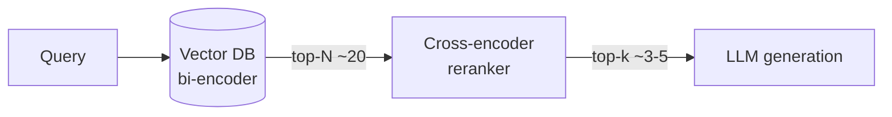

# Reranking

Reranking is a two-stage retrieval strategy: first retrieve a broad candidate set cheaply with a bi-encoder, then score each candidate against the query precisely with a slower cross-encoder, keeping only the most relevant results for generation.

## What you'll learn

- The architectural difference between bi-encoders and cross-encoders
- Why retrieving more than you need (top-N) then reranking to top-k improves quality
- A runnable local reranker using `cross-encoder/ms-marco-MiniLM-L-6-v2`
- Latency trade-offs and when reranking is worth the cost

## Bi-encoders vs cross-encoders

| Property | Bi-encoder | Cross-encoder |
|---|---|---|
| How it works | Encodes query and doc independently; compare embeddings | Encodes query + doc jointly; outputs a relevance score |
| Speed | Fast — vectors are pre-computed | Slow — must run inference per (query, doc) pair |
| Quality | Good for coarse ranking | Higher accuracy, captures fine-grained interactions |
| Use in RAG | First-stage retrieval (ANN search) | Second-stage reranking of top-N candidates |

A bi-encoder cannot see the query when encoding documents, so it misses subtle query-specific signals. A cross-encoder attends to both simultaneously — much more expressive, but O(N) inference at query time.



## Runnable reranking example

```bash
pip install sentence-transformers chromadb
```

```python
# rerank.py
import chromadb
from chromadb.utils.embedding_functions import SentenceTransformerEmbeddingFunction
from sentence_transformers import CrossEncoder

# --- Build a small ChromaDB collection ---
docs = [
    "Reranking improves RAG by scoring query-document pairs jointly.",
    "BM25 is a classic sparse retrieval algorithm.",
    "Cross-encoders are slower but more accurate than bi-encoders.",
    "Ollama lets you run large language models locally on your machine.",
    "The MiniLM cross-encoder is a lightweight reranking model.",
    "Sentence transformers produce fixed-size dense embeddings.",
    "Retrieval-Augmented Generation grounds LLM answers in external knowledge.",
    "Hybrid search combines dense and sparse retrieval methods.",
]
ids = [f"d{i}" for i in range(len(docs))]

ef = SentenceTransformerEmbeddingFunction("all-MiniLM-L6-v2")
client = chromadb.Client()
col = client.create_collection("rerank_demo", embedding_function=ef)
col.add(documents=docs, ids=ids)

# --- Stage 1: retrieve top-N with bi-encoder ---
query = "how does a cross-encoder improve retrieval quality?"
TOP_N = 6  # retrieve more than we need
TOP_K = 3  # keep only these after reranking

results = col.query(query_texts=[query], n_results=TOP_N)
candidates = results["documents"][0]  # list of strings

# --- Stage 2: rerank with cross-encoder ---
cross_encoder = CrossEncoder("cross-encoder/ms-marco-MiniLM-L-6-v2")
pairs = [[query, doc] for doc in candidates]
scores = cross_encoder.predict(pairs)  # float array, higher = more relevant

# Sort candidates by cross-encoder score descending
ranked = sorted(zip(candidates, scores), key=lambda x: x[1], reverse=True)

print(f"Top-{TOP_K} after reranking:")
for i, (doc, score) in enumerate(ranked[:TOP_K], 1):
    print(f"  {i}. [{score:.3f}] {doc}")
```

Sample output:

```text
Top-3 after reranking:
  1. [9.241] Cross-encoders are slower but more accurate than bi-encoders.
  2. [8.876] Reranking improves RAG by scoring query-document pairs jointly.
  3. [7.103] The MiniLM cross-encoder is a lightweight reranking model.
```

## Latency trade-offs

!!! warning "Reranking adds latency"
    Running a cross-encoder on N candidates is O(N) inference calls. With N=20 and a MiniLM model, expect ~50–150 ms on CPU. Keep N small (10–25) and use a distilled model like `ms-marco-MiniLM-L-6-v2` to stay within acceptable latency budgets.

!!! tip "Batching helps"
    `CrossEncoder.predict()` accepts a batch of pairs — always pass all pairs at once rather than one-by-one to benefit from batched matrix operations.

### Choosing TOP_N

A common heuristic: retrieve `TOP_N = 4–10× TOP_K`. If you want 3 final docs, retrieve 15–30 candidates. Diminishing returns kick in beyond ~30 candidates for most corpora.

### Hosted alternatives

Services like Cohere Rerank and Jina Reranker offer hosted cross-encoders via API. For fully local, air-gapped, or cost-sensitive deployments, the sentence-transformers approach above is the recommended path.

## Next steps

- [Hybrid search](hybrid-search.md) — combine BM25 + dense retrieval before reranking for maximum recall
- [Evaluation](evaluation.md) — measure whether reranking actually improves your hit rate and MRR
