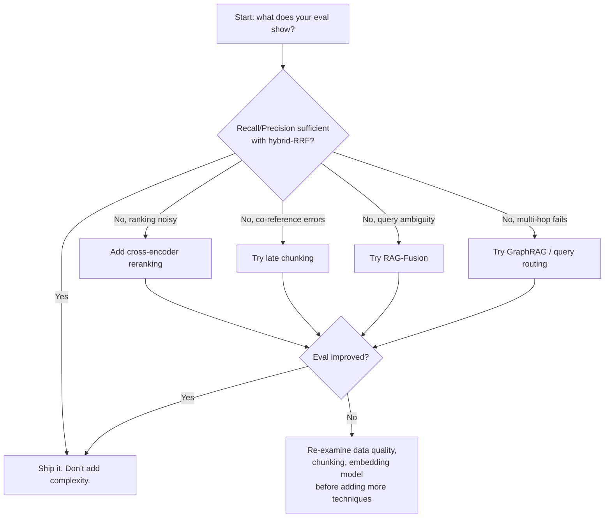

# Retrieval Techniques Compared

There is no universally best retrieval strategy. Each technique addresses a specific weakness in its predecessor, and each introduces new costs. This page gives you an honest, side-by-side view so you can choose — and evaluate — only what your problem actually needs.

## What you'll learn

- What each major retrieval technique does and what problem it solves
- When a technique helps vs when it adds overhead without benefit
- Honest benchmark context — numbers are dataset-specific, not universal laws
- A decision framework: start simple, add complexity only when evals justify it

---

## The benchmark honesty disclaimer

!!! warning "Numbers are dataset-specific"
    Performance figures in this page (and in the literature) come from specific benchmarks with specific data distributions. A technique that wins on one benchmark may lose or break even on yours. The numbers below come from the [T2-RAGBench financial text+table benchmark (arXiv 2604.01733)](https://arxiv.org/abs/2604.01733) unless otherwise noted. **Run your own evals on your own data.** See [evaluation.md](evaluation.md) for a local eval setup.

---

## Techniques at a glance

| Technique | What it does | Problem it solves | Helps most when | Maturity | Incremental cost |
|---|---|---|---|---|---|
| **BM25** | Lexical keyword match with TF-IDF-style scoring | Baseline sparse retrieval | Exact keyword queries; out-of-distribution terms | Proven, decades-old | ~Zero (inverted index) |
| **Dense retrieval** | Encode query and docs into shared embedding space; ANN search | Semantic similarity beyond exact keywords | Paraphrase, synonym-heavy queries | Mature | Embedding inference + vector index |
| **Hybrid (RRF)** | Merge BM25 + dense rankings via Reciprocal Rank Fusion | Neither BM25 nor dense alone is optimal | Most production workloads — the reliable default | Mature | BM25 + dense in parallel; RRF merge |
| **Cross-encoder reranking** | Re-score top-K candidates with a query-doc pair model | Initial retrieval has noisy ranking | After any retrieval pass, especially on tables/structured text | Mature | Inference on top-K pairs at query time |
| **Late chunking** | Embed full document, then pool token embeddings per chunk | Naive chunking loses cross-chunk context (co-references) | Documents with pronouns, abbreviations, entity aliases across chunks | Emerging (2024) | One long forward pass per doc at index time |
| **RAG-Fusion** | Generate N query variants, retrieve for each, merge with RRF | Single query misses relevant angles | Ambiguous or broad queries with multiple valid interpretations | Emerging | N × retrieval + N × LLM query generation |
| **RAPTOR** | Cluster and recursively summarise chunks into a tree | Long-doc global reasoning needs coarse-grained context | Long documents where answer spans many chunks | Experimental | Expensive offline clustering + summarisation |
| **Self-RAG** | LLM decides whether to retrieve, then critiques its own outputs | Unnecessary retrieval on answerable queries | High-quality generation where hallucination risk is high | Experimental | Multiple LLM calls per query |
| **Corrective RAG (CRAG)** | Grade retrieved docs; re-retrieve or web-search if weak | Retrieval returns irrelevant docs | Open-domain QA with weak in-corpus coverage | Experimental | Grader LLM call; conditional web fallback |
| **ColBERT / multi-vector** | Store per-token vectors; MaxSim matching at retrieval | Dense retrieval misses fine-grained phrase-level matches | Precision-critical search on small-to-medium corpora | Research-grade | ~500× storage vs single-vector dense |

---

## Technique deep dives

### BM25

The unchanged workhorse. Scores documents by term frequency, inverse document frequency, and document length normalisation. Completely misses synonyms and paraphrases, but is unbeatable when the query contains rare or technical tokens that embedding models have never seen in training.

**Local tooling:** `rank_bm25` (Python), `elasticsearch` / `opensearch` (if you need a server). ChromaDB does not natively expose BM25 — pair it with a separate BM25 index for hybrid retrieval.

---

### Dense retrieval

Encodes both query and document chunks into the same vector space using a bi-encoder (e.g. `sentence-transformers/all-MiniLM-L6-v2`). Retrieval is ANN search (cosine or dot-product similarity). See [../foundations/embeddings.md](../foundations/embeddings.md) and [../foundations/vector-databases.md](../foundations/vector-databases.md).

**Weakness:** fails on exact-match keyword queries and out-of-vocabulary technical terms.

---

### Hybrid retrieval with RRF

The production default for most RAG systems. Run BM25 and dense in parallel, then merge with Reciprocal Rank Fusion:

```
RRF_score(doc) = Σ_ranker 1 / (k + rank_in_ranker)
```

On the [T2-RAGBench benchmark (arXiv 2604.01733)](https://arxiv.org/abs/2604.01733), hybrid-RRF achieved **Recall@5 of 0.695**, well above BM25 alone at 0.644 — on that dataset. Your mileage will vary; run your own evals.

See [hybrid-search.md](hybrid-search.md) for a full local implementation with ChromaDB + BM25.

---

### Cross-encoder reranking

A cross-encoder takes the (query, document) pair as a single input and produces a relevance score. Because it sees both together (unlike bi-encoders which embed them separately), it captures query-document interaction at the token level.

On the same [T2-RAGBench benchmark (arXiv 2604.01733)](https://arxiv.org/abs/2604.01733), adding reranking on top of hybrid-RRF brought Recall@5 to **0.816** and improved MRR@3 by **+17.2 percentage points** over hybrid alone. This is a large gain — on this particular financial text+table benchmark. The effect may be smaller or absent on purely prose-based corpora.

!!! note "One benchmark caveat"
    The T2-RAGBench gain is especially pronounced because the benchmark contains structured tables, where cross-encoders excel at matching numeric/tabular values precisely. Do not assume +17pp on your dataset without measuring.

See [reranking.md](reranking.md) for a local implementation with `cross-encoder/ms-marco-MiniLM-L-6-v2`.

---

### Late chunking

Embed the whole document first with a long-context model, then mean-pool token embeddings per chunk. Preserves co-reference context that naive chunk-then-embed destroys.

Storage cost is similar to standard dense retrieval (~1× baseline), unlike ColBERT which is ~500× (approximate, [per Weaviate](https://weaviate.io/blog/late-chunking)). Requires a long-context embedding model and a single full-document forward pass at index time.

See [late-chunking.md](late-chunking.md) for a full walkthrough.

---

### RAG-Fusion

Generate multiple query reformulations (with an LLM), run retrieval for each, and merge with RRF. Increases recall on ambiguous queries. Increases cost linearly with the number of variants — typically 3–5.

**When to skip it:** if your queries are precise and specific, the variants add noise rather than signal. Measure first.

---

### RAPTOR

Recursively clusters and summarises document chunks into a tree. At query time, retrieval can happen at any level of the tree — coarse summary nodes for broad questions, leaf nodes for specific ones.

**When it helps:** very long documents (entire books, large report corpora) where answers require integrating many sections. **When to skip it:** short documents, low-latency requirements, or corpora where offline processing cost is prohibitive.

---

### Self-RAG

The LLM generates a retrieval decision token before answering: should I retrieve? It then critiques retrieved passages with reflection tokens (is this relevant? is this supported?). Can improve factuality on generation-heavy tasks.

**Practical reality:** requires a specially fine-tuned model or significant prompt engineering. Multiple LLM calls per query. Hard to deploy reliably in production without careful calibration.

---

### Corrective RAG (CRAG)

Grades retrieved documents for relevance; if below a threshold, discards them and falls back to a web search or re-retrieval. Intuition: bad retrieval is worse than no retrieval.

!!! warning "CRAG is situational — it can underperform"
    On the [T2-RAGBench benchmark (arXiv 2604.01733)](https://arxiv.org/abs/2604.01733), CRAG achieved Recall@5 of **0.658** — below plain hybrid-RRF at 0.695. The extra grader call added latency without net benefit on that corpus. CRAG is most valuable when your index has genuine coverage gaps and a reliable fallback (web search, a secondary index) exists. Do not add it by default.

---

### ColBERT / multi-vector retrieval

Stores one vector per document token rather than one per chunk. At query time, a MaxSim operation matches each query token against all document token vectors. Gives fine-grained phrase-level matching beyond what bi-encoders can do.

**Storage cost:** approximately 500× that of single-vector dense retrieval (approximate figure from [Weaviate's analysis](https://weaviate.io/blog/late-chunking)). Practical at small corpus sizes; challenging at scale without specialised infrastructure (RAGatouille, Vespa, ColBERT-live).

---

## Decision framework



!!! tip "The single most important principle"
    Start with hybrid-RRF. It is mature, well-understood, and beats either BM25 or dense alone on most corpora. Add complexity — reranking, late chunking, routing, CRAG — only when your evals on your data show a meaningful improvement that justifies the added latency and infrastructure cost.

---

## Summary table: cost vs benefit

| Technique | Indexing overhead | Query latency overhead | Typical benefit | Risk |
|---|---|---|---|---|
| BM25 | Low | Negligible | Keyword recall | Misses paraphrase |
| Dense | Medium | Low (ANN) | Semantic recall | Misses rare terms |
| Hybrid-RRF | Medium | Low | Best of both | Marginal on keyword-only corpora |
| Reranking | Low | Medium (+top-K inference) | Ranking quality, especially tables | Latency; overkill if recall is already fine |
| Late chunking | Medium (long fwd pass) | None | Cross-chunk context | Needs long-context model |
| RAG-Fusion | Low | Medium (+N×LLM) | Ambiguous query recall | Adds noise if queries are precise |
| RAPTOR | High (offline clustering) | Low | Long-doc global reasoning | Expensive; fragile |
| Self-RAG | Low | High (+multi-LLM) | Factuality | Requires fine-tuned model |
| CRAG | Low | Medium (+grader) | Graceful fallback | Can hurt recall (as on T2-RAGBench) |
| ColBERT | Very high (~500× storage) | Medium (MaxSim) | Phrase-level precision | Infrastructure cost |

---

## Next steps

- Implement hybrid retrieval locally: [hybrid-search.md](hybrid-search.md).
- Add a cross-encoder reranker on top: [reranking.md](reranking.md).
- Measure whether any of this actually helps on your data: [evaluation.md](evaluation.md).
