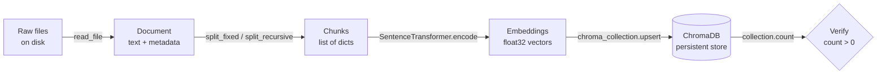

# Indexing Pipeline

The indexing pipeline is the offline job that transforms raw documents into a searchable vector store — run it once (or whenever your corpus changes) so the online query path stays fast.

## What you'll learn

- The four stages of an offline RAG ingest: load, chunk, embed, store
- How to embed with `sentence-transformers` and L2-normalise vectors
- How to persist a ChromaDB collection with stable document IDs
- How to handle idempotency and incremental updates
- How to verify the index before serving queries

---

## Pipeline overview



---

## Full `ingest.py` script

Install dependencies first:

```bash
pip install chromadb sentence-transformers pypdf
```

```python
"""ingest.py — offline indexing pipeline for RAG Lab.

Usage:
    python ingest.py --docs ./data --db ./chroma_db --collection my_docs
"""
from __future__ import annotations
import argparse
import hashlib
import pathlib

import chromadb
from sentence_transformers import SentenceTransformer

# ── Re-use helpers from document-loaders and text-splitting pages ──────────────

def read_file(path: pathlib.Path) -> dict:
    """Return {"text": str, "metadata": dict} for txt/md/pdf."""
    ext = path.suffix.lower()
    metadata = {"source": str(path), "filename": path.name}

    if ext in {".txt", ".md"}:
        text = path.read_text(encoding="utf-8", errors="replace")

    elif ext == ".pdf":
        from pypdf import PdfReader
        reader = PdfReader(str(path))
        text = "\n".join(p.extract_text() or "" for p in reader.pages)
        metadata["page_count"] = len(reader.pages)

    else:
        raise ValueError(f"Unsupported: {ext}")

    return {"text": text.strip(), "metadata": metadata}


def split_fixed(
    text: str,
    chunk_size: int = 512,
    chunk_overlap: int = 64,
    metadata: dict | None = None,
) -> list[dict]:
    metadata = metadata or {}
    chunks, start = [], 0
    while start < len(text):
        snippet = text[start : start + chunk_size]
        if snippet.strip():
            chunks.append({
                "text": snippet,
                "metadata": {**metadata, "chunk_index": len(chunks)},
            })
        start += chunk_size - chunk_overlap
    return chunks


def stable_id(source: str, chunk_index: int) -> str:
    """Deterministic ID so re-running the script is idempotent."""
    raw = f"{source}::{chunk_index}"
    return hashlib.md5(raw.encode()).hexdigest()


# ── Core pipeline ──────────────────────────────────────────────────────────────

def ingest(
    docs_dir: str,
    db_path: str,
    collection_name: str,
    chunk_size: int = 512,
    chunk_overlap: int = 64,
    embed_model: str = "all-MiniLM-L6-v2",
    batch_size: int = 64,
) -> None:
    docs_dir = pathlib.Path(docs_dir)
    supported = {".txt", ".md", ".pdf"}

    # 1. Load ──────────────────────────────────────────────────────────────────
    documents: list[dict] = []
    for filepath in sorted(docs_dir.rglob("*")):
        if filepath.suffix.lower() in supported:
            print(f"  Loading {filepath.name} …")
            try:
                documents.append(read_file(filepath))
            except Exception as exc:
                print(f"  [WARN] Skipping {filepath.name}: {exc}")

    if not documents:
        print("No supported documents found. Exiting.")
        return

    # 2. Chunk ─────────────────────────────────────────────────────────────────
    all_chunks: list[dict] = []
    for doc in documents:
        chunks = split_fixed(
            doc["text"],
            chunk_size=chunk_size,
            chunk_overlap=chunk_overlap,
            metadata=doc["metadata"],
        )
        all_chunks.extend(chunks)

    print(f"\n  {len(documents)} document(s) → {len(all_chunks)} chunks")

    # 3. Embed ─────────────────────────────────────────────────────────────────
    print(f"  Loading embedder: {embed_model}")
    embedder = SentenceTransformer(embed_model)

    texts = [c["text"] for c in all_chunks]
    print(f"  Embedding {len(texts)} chunks …")
    # normalize_embeddings=True ensures cosine similarity == dot product
    embeddings = embedder.encode(
        texts,
        batch_size=batch_size,
        show_progress_bar=True,
        normalize_embeddings=True,
    )

    # 4. Store ─────────────────────────────────────────────────────────────────
    client = chromadb.PersistentClient(path=db_path)
    collection = client.get_or_create_collection(
        name=collection_name,
        metadata={"hnsw:space": "cosine"},
    )

    ids = [
        stable_id(c["metadata"]["source"], c["metadata"]["chunk_index"])
        for c in all_chunks
    ]
    metadatas = [c["metadata"] for c in all_chunks]

    # upsert = insert-or-update; safe to run multiple times
    print("  Upserting into ChromaDB …")
    for i in range(0, len(ids), batch_size):
        collection.upsert(
            ids=ids[i : i + batch_size],
            embeddings=embeddings[i : i + batch_size].tolist(),
            documents=texts[i : i + batch_size],
            metadatas=metadatas[i : i + batch_size],
        )

    # 5. Verify ────────────────────────────────────────────────────────────────
    count = collection.count()
    print(f"\n  Done. ChromaDB collection '{collection_name}' has {count} vectors.")
    assert count > 0, "Indexing produced zero vectors — check your documents."


# ── CLI entry point ────────────────────────────────────────────────────────────

if __name__ == "__main__":
    parser = argparse.ArgumentParser(description="RAG Lab ingest pipeline")
    parser.add_argument("--docs", default="./data", help="Folder of source documents")
    parser.add_argument("--db", default="./chroma_db", help="ChromaDB persistence path")
    parser.add_argument("--collection", default="rag_docs", help="Collection name")
    parser.add_argument("--chunk-size", type=int, default=512)
    parser.add_argument("--chunk-overlap", type=int, default=64)
    args = parser.parse_args()

    ingest(
        docs_dir=args.docs,
        db_path=args.db,
        collection_name=args.collection,
        chunk_size=args.chunk_size,
        chunk_overlap=args.chunk_overlap,
    )
```

Run it:

```bash
python ingest.py --docs ./data --db ./chroma_db --collection rag_docs
```

---

## Idempotency and re-indexing

!!! note "Why `upsert` matters"
    ChromaDB's `upsert` replaces an existing vector if the ID already exists. Because `stable_id` hashes `source::chunk_index`, re-running the script on the same files simply overwrites the same records — no duplicates accumulate.

!!! tip "Incremental updates"
    To add only new files without re-embedding everything, track ingested filenames in a small SQLite table or a plain text manifest. Query the collection for existing source values before deciding which files to skip:

    ```python
    existing = collection.get(where={"source": str(filepath)})
    if existing["ids"]:
        print(f"  Already indexed: {filepath.name} — skipping")
        continue
    ```

!!! warning "Schema changes"
    If you change `chunk_size` or the embed model, the old vectors are no longer comparable to new ones. Delete the collection and re-run the full ingest:

    ```python
    client.delete_collection(collection_name)
    ```

---

## Next steps

- [Generation](generation.md) — use the index you just built to answer questions at query time
- [Projects — Local RAG](../projects/local-rag.md) — a complete end-to-end project that wraps this pipeline
