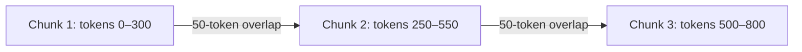

# Chunking

Chunking splits large documents into smaller pieces before embedding — the size and strategy you choose directly determines whether retrieved context is useful or noise.

## What you'll learn

- Why full documents are rarely embedded whole
- The chunk-size vs. precision/context trade-off
- What chunk overlap does and when to use it
- Fixed, recursive, and structure-aware splitting strategies
- What metadata to attach to every chunk

---

## Why chunk at all?

Embedding an entire 50-page PDF produces one vector that averages the meaning of everything — a query about page 3 might match it weakly. Splitting into paragraphs gives each chunk a sharp semantic signal, so retrieval returns the *specific* passage that answers the query.

!!! warning "Chunk too small → missing context; chunk too large → diluted signal"
    A 50-token chunk might lack the surrounding sentence needed to understand a pronoun. A 2 000-token chunk might match many queries but buries the relevant sentence inside irrelevant text.

---

## Chunk size and overlap

**Chunk size** (in tokens or characters) controls the granularity of retrieval. **Overlap** copies the tail of one chunk into the head of the next, preventing a sentence from being cut in half at a boundary.



| Chunk size | Overlap | Best for |
|---|---|---|
| 128–256 tokens | 20–32 tokens | Precise factual Q&A |
| 256–512 tokens | 50 tokens | General RAG (recommended start) |
| 512–1 024 tokens | 100 tokens | Summarization, long-context tasks |

---

## Splitting strategies

### Fixed-size splitting

Split every N characters or tokens regardless of content. Fast, but can break sentences mid-thought.

### Recursive character splitting

Try to split on `\n\n` (paragraph), then `\n` (line), then `. ` (sentence), then ` ` (word), stopping when chunks are small enough. This preserves natural boundaries as much as possible and is the best default.

```python
def recursive_split(text: str, chunk_size: int = 400, overlap: int = 50) -> list[str]:
    """Simple recursive splitter — splits on paragraphs first, then sentences."""
    separators = ["\n\n", "\n", ". ", " "]
    chunks = []

    def split(text: str, sep_idx: int = 0) -> None:
        if len(text) <= chunk_size or sep_idx >= len(separators):
            if text.strip():
                chunks.append(text.strip())
            return
        sep = separators[sep_idx]
        parts = text.split(sep)
        current = ""
        for part in parts:
            candidate = current + sep + part if current else part
            if len(candidate) <= chunk_size:
                current = candidate
            else:
                if current:
                    chunks.append(current.strip())
                    # carry overlap into next chunk
                    overlap_text = current[-overlap:] if len(current) > overlap else current
                    current = overlap_text + sep + part
                else:
                    split(part, sep_idx + 1)
                    current = ""
        if current.strip():
            chunks.append(current.strip())

    split(text)
    return chunks

# Usage
with open("my_document.txt") as f:
    text = f.read()

chunks = recursive_split(text, chunk_size=400, overlap=50)
print(f"Produced {len(chunks)} chunks")
```

!!! tip "Use LangChain's `RecursiveCharacterTextSplitter` in production"
    The hand-rolled version above illustrates the concept. For production use `langchain_text_splitters.RecursiveCharacterTextSplitter` which handles token counting and edge cases robustly.

### Structure-aware splitting

For Markdown, split on headers (`#`, `##`). For code, split on function definitions. For PDFs with known sections, split on section titles. This keeps related content together and avoids breaking tables or code blocks.

---

## Metadata to attach to every chunk

Every chunk stored in the vector DB should carry metadata that enables filtering and citation:

```python
chunk_metadata = {
    "source":      "annual_report_2024.pdf",
    "page":        12,
    "chunk_index": 3,
    "section":     "Financial Highlights",
}
```

!!! example "Metadata enables source citation"
    When you return a chunk to the user, you can say "From *annual_report_2024.pdf*, page 12" — which is only possible if you stored that metadata at index time.

---

## Rules of thumb

| Situation | Recommendation |
|---|---|
| Starting out, unknown document type | 400 chars, 50-char overlap, recursive split |
| Technical docs / Markdown | Structure-aware (split on headers) |
| Dense tables or code | Larger chunks (512–1 024 tokens) with no overlap |
| Very short queries expected | Smaller chunks (128–256 tokens) |
| Very long answer expected | Larger chunks; consider parent-child retrieval |

---

## Next steps

- [Text Splitting (building blocks)](../building-blocks/text-splitting.md) — deeper dive with LangChain and LlamaIndex splitters
- [Retrieval](retrieval.md) — how chunked and indexed text gets matched to queries
