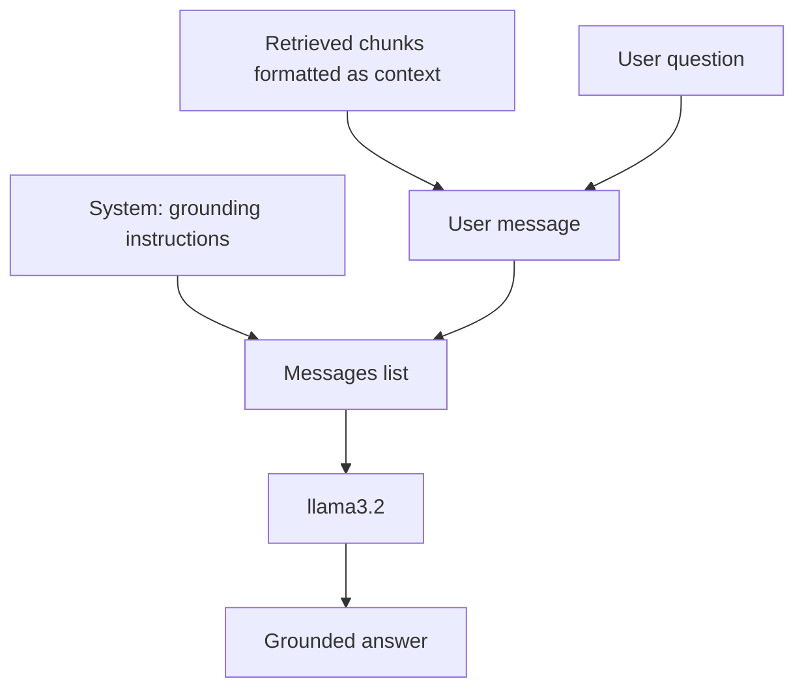

# Prompting for RAG

The augmented prompt is where retrieved context meets the LLM — how you structure it determines whether the model stays grounded, cites sources, and admits ignorance gracefully.

## What you'll learn

- How to build a system prompt that grounds the model in retrieved context
- How to format retrieved chunks inside the user turn
- How to handle the "I don't know" case
- Why context ordering matters
- How to budget tokens across system, context, and answer

---

## The anatomy of a RAG prompt

A RAG prompt has three parts sent in the `messages` list:

1. **System message** — tells the model its role and the grounding rule
2. **User message** — contains the retrieved context blocks and the actual question
3. **Assistant** — generated by the model



---

## System prompt for grounding

```python
SYSTEM_PROMPT = """You are a helpful assistant that answers questions \
using ONLY the context passages provided below.

Rules:
- If the answer is present in the context, answer accurately and cite the source \
  using [Source: <source>] at the end of the relevant sentence.
- If the context does not contain enough information to answer the question, \
  respond with: "I don't have enough information in the provided context to answer that."
- Do NOT use any knowledge outside the context passages.
- Keep answers concise (under 200 words unless the question requires more detail).
"""
```

!!! warning "Don't skip the grounding rule"
    Without an explicit instruction like "use ONLY the context", LLMs will blend retrieved facts with training-data guesses, making hallucinations harder to detect.

---

## Formatting retrieved chunks

Wrap each chunk with its source so the model can cite it:

```python
def format_context(results: dict) -> str:
    """Format ChromaDB results into a context block."""
    blocks = []
    for doc, meta in zip(results["documents"][0], results["metadatas"][0]):
        source = meta.get("source", "unknown")
        page   = meta.get("page", "")
        label  = f"{source}, p.{page}" if page else source
        blocks.append(f"[Source: {label}]\n{doc}")
    return "\n\n---\n\n".join(blocks)
```

---

## Full `ollama.chat` call

```python
import ollama
import chromadb
from sentence_transformers import SentenceTransformer

# --- Retrieval ---
client = chromadb.PersistentClient(path="./chroma_db")
collection = client.get_collection("rag_docs")
embed_model = SentenceTransformer("all-MiniLM-L6-v2")

query = "What distance metric does ChromaDB use by default?"
query_vec = embed_model.encode([query], normalize_embeddings=True).tolist()

results = collection.query(
    query_embeddings=query_vec,
    n_results=3,
    include=["documents", "metadatas"],
)

context = format_context(results)  # function defined above

# --- Prompt assembly ---
user_message = f"Context passages:\n\n{context}\n\nQuestion: {query}"

# --- Generation ---
response = ollama.chat(
    model="llama3.2",
    messages=[
        {"role": "system", "content": SYSTEM_PROMPT},
        {"role": "user",   "content": user_message},
    ],
    options={"temperature": 0.0, "num_predict": 512},
)

print(response["message"]["content"])
```

---

## Handling "I don't know"

The system prompt already instructs the model to say it lacks information. Reinforce this by never injecting chunks that scored above your distance threshold — an empty context block is a valid signal.

```python
FALLBACK = "I don't have enough information in the provided context to answer that."

if not results["documents"][0]:
    print(FALLBACK)
else:
    # proceed with ollama.chat as above
    ...
```

!!! example "Test the fallback explicitly"
    Ask a question that is clearly outside your indexed documents. If the model still answers confidently, tighten the system-prompt grounding rule or lower your similarity threshold.

---

## Context ordering and token budgeting

**Order matters**: LLMs pay more attention to content at the beginning and end of the context window than to the middle ("lost in the middle" effect). Put the most relevant chunk first.

**Token budget** — budget your tokens before sending:

| Slot | Typical budget |
|---|---|
| System prompt | 150–300 tokens |
| Retrieved context (3–5 chunks × 400 chars) | 600–2 000 tokens |
| User question | 20–100 tokens |
| Answer (`num_predict`) | 256–512 tokens |
| Safety margin | 100 tokens |

Stay well within `llama3.2`'s 128 k-token window for local use; exceeding it silently drops the oldest tokens.

!!! tip "Sort by relevance (ascending distance) before formatting"
    `results["distances"][0]` is already sorted ascending by ChromaDB — the most relevant chunk is first. Format them in that order.

---

## Next steps

- [Generation (building blocks)](../building-blocks/generation.md) — wiring retrieval and generation into a reusable pipeline class
- [Evaluation](../advanced/evaluation.md) — measure faithfulness, answer relevance, and context precision
