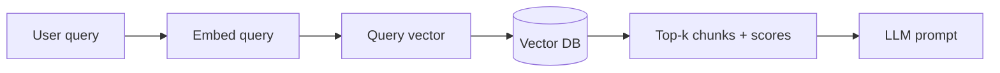

# Retrieval

Retrieval is the step where your query becomes a vector and the vector database returns the most relevant chunks — the quality of everything downstream depends on getting this right.

## What you'll learn

- How a query is embedded and matched against stored vectors
- What top-k and similarity thresholds do
- What good vs. bad retrieval looks like in practice
- How Maximal Marginal Relevance (MMR) adds diversity
- How to run a ChromaDB query with distance scores

---

## The retrieval pipeline



Every step is synchronous and local — no API call required when using Ollama + ChromaDB.

---

## Embedding the query

The query **must be embedded with the same model used to embed the documents**. Using a different model produces vectors in a different space — similarity scores become meaningless.

```python
from sentence_transformers import SentenceTransformer

model = SentenceTransformer("all-MiniLM-L6-v2")
query = "What are the main causes of transformer hallucination?"
query_vec = model.encode([query], normalize_embeddings=True).tolist()
```

---

## Top-k and similarity thresholds

**`n_results` (top-k)** controls how many chunks are returned. Start with `k=3–5`. Too few means you might miss a relevant chunk; too many floods the prompt with noise.

**Similarity threshold** filters out chunks below a minimum score. With cosine distance, a distance of 0 means identical and 1 means orthogonal. A threshold of `distance < 0.4` keeps only genuinely related chunks.

!!! warning "A high distance score means low similarity"
    ChromaDB returns cosine *distance* (lower = more similar). Don't confuse this with cosine *similarity* (higher = more similar). Always check: `similarity = 1 − distance`.

---

## ChromaDB query with scores

```python
import chromadb
from sentence_transformers import SentenceTransformer

client = chromadb.PersistentClient(path="./chroma_db")
collection = client.get_collection("rag_docs")

model = SentenceTransformer("all-MiniLM-L6-v2")
query = "How does HNSW speed up vector search?"
query_vec = model.encode([query], normalize_embeddings=True).tolist()

results = collection.query(
    query_embeddings=query_vec,
    n_results=4,
    include=["documents", "distances", "metadatas"],
)

DISTANCE_THRESHOLD = 0.45  # tune per dataset

for doc, dist, meta in zip(
    results["documents"][0],
    results["distances"][0],
    results["metadatas"][0],
):
    sim = 1 - dist
    if dist > DISTANCE_THRESHOLD:
        print(f"[SKIPPED — too distant ({dist:.3f})] {doc[:60]}...")
        continue
    print(f"[sim={sim:.3f}] ({meta.get('source', 'unknown')}) {doc[:80]}...")
```

---

## Good vs. bad retrieval

| Sign | Likely cause | Fix |
|---|---|---|
| Returned chunks are off-topic | Chunks too large (diluted signal) | Reduce chunk size |
| Relevant chunk missing entirely | Chunk size too small, split mid-sentence | Increase overlap or chunk size |
| Top chunk is correct but rank 3–4 is noise | k too high | Lower k or add threshold |
| No chunks pass threshold | Query phrasing doesn't match doc language | Use query transformation or HyDE |
| Same chunk returned multiple times | Exact duplicate documents in index | Deduplicate at index time |

---

## MMR: adding diversity

**Maximal Marginal Relevance** balances relevance and novelty. Instead of returning the 5 most similar chunks (which might all say the same thing), MMR iteratively picks the next chunk that is relevant to the query *and* different from already-selected chunks.

!!! note "MMR is available in LangChain retriever wrappers"
    ChromaDB itself returns ranked results; MMR post-processing is applied by the retriever layer. Set `search_type="mmr"` on a LangChain `Chroma` retriever.

!!! tip "Garbage in, garbage out"
    A well-tuned LLM cannot compensate for bad retrieval. If the top-k chunks don't contain the answer, no amount of prompt engineering will invent it correctly. Evaluate retrieval precision and recall independently before tuning the generation step.

---

## Next steps

- [Prompting for RAG](prompting-rag.md) — take your retrieved chunks and build the augmented prompt
- [Reranking](../advanced/reranking.md) — use a cross-encoder to reorder retrieved chunks for higher precision
