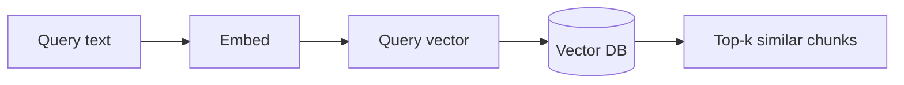

# Vector Databases

A vector database stores embedding vectors and lets you find the most similar ones to a query vector in milliseconds — even across millions of documents.

## What you'll learn

- What a vector database does differently from a relational DB
- The difference between exact and approximate nearest-neighbor search
- How HNSW makes large-scale ANN search practical
- Which distance metric to use and why
- How to add and query documents with ChromaDB

---

## What problem does a vector DB solve?

After you embed your documents, you need to answer the question: *"Which stored vectors are closest to this query vector?"* A plain SQL `WHERE` clause can't do this efficiently. A vector DB indexes the vectors so that similarity search is fast.



---

## Exact vs. approximate nearest neighbor (ANN)

**Exact k-NN** computes the distance from the query to every stored vector. This is O(n) and becomes too slow beyond ~100 k vectors.

**Approximate nearest neighbor (ANN)** algorithms trade a small accuracy loss for massive speed gains, making sub-millisecond search over millions of vectors practical.

!!! note "ChromaDB uses HNSW by default"
    Hierarchical Navigable Small World (HNSW) builds a multi-layer graph where each layer is a sparser version of the one below. Search starts at the top (coarse), then greedily descends to the bottom (fine). This gives O(log n) average search time.

---

## Distance metrics

| Metric | Formula | When to use |
|---|---|---|
| Cosine similarity | `1 − cos(θ)` | Normalized embeddings (most common) |
| Dot product | `−(a · b)` | Un-normalized embeddings |
| L2 (Euclidean) | `‖a − b‖₂` | When magnitude carries meaning |

For `all-MiniLM-L6-v2` with `normalize_embeddings=True`, cosine and dot product give identical rankings — use `cosine` for clarity.

---

## Metadata filtering

Vector DBs attach arbitrary key-value metadata to each vector. You can pre-filter by metadata before the ANN search, which dramatically narrows the candidate set.

```python
# Only search chunks from a specific source file
results = collection.query(
    query_embeddings=[query_vec],
    n_results=5,
    where={"source": "annual_report_2024.pdf"},
)
```

---

## Minimal ChromaDB example

```bash
pip install chromadb sentence-transformers
```

```python
import chromadb
from sentence_transformers import SentenceTransformer

# In-memory client (no server required)
client = chromadb.Client()
collection = client.create_collection(
    name="rag_docs",
    metadata={"hnsw:space": "cosine"},
)

model = SentenceTransformer("all-MiniLM-L6-v2")

docs = [
    "Ollama runs LLMs locally on consumer hardware.",
    "ChromaDB is an open-source vector database.",
    "Sentence transformers produce 384-dimensional embeddings.",
]
ids = ["doc_0", "doc_1", "doc_2"]
embeddings = model.encode(docs, normalize_embeddings=True).tolist()

collection.add(documents=docs, embeddings=embeddings, ids=ids)

# Query
query = "How do I run a language model on my laptop?"
query_vec = model.encode([query], normalize_embeddings=True).tolist()

results = collection.query(query_embeddings=query_vec, n_results=2)

for doc, distance in zip(results["documents"][0], results["distances"][0]):
    print(f"[{distance:.3f}] {doc}")
```

!!! tip "Persist to disk"
    Replace `chromadb.Client()` with `chromadb.PersistentClient(path="./chroma_db")` to survive process restarts.

---

## In-memory vs. dedicated store

| Scenario | Recommendation |
|---|---|
| < 50 k chunks, local dev | ChromaDB in-memory or persistent client |
| 50 k – 5 M chunks, single machine | ChromaDB persistent client with HNSW |
| Multi-user, production service | ChromaDB HTTP server or a managed alternative |

!!! warning "Don't over-engineer early"
    Start with a local persistent ChromaDB. Move to a server or managed service only when latency or concurrency becomes a real constraint.

---

## Next steps

- [Retrieval](retrieval.md) — turn stored vectors into useful context for your LLM
- [Vector Stores (tools)](../tools/vector-stores.md) — compare ChromaDB, FAISS, Qdrant, and others
