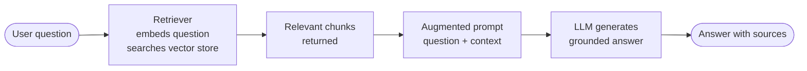

# What Is RAG?

Retrieval-Augmented Generation (RAG) is a pattern that gives a language model access to relevant documents at query time, so its answers are grounded in real, up-to-date information rather than only its training weights.

## What you'll learn

- The retrieve → augment → generate loop and why each step matters
- How RAG compares to plain LLMs, fine-tuning, and long-context stuffing
- When RAG is the right tool and when it is not
- A concrete end-to-end mini-example

## The core loop



1. **Retrieve** — the user's question is converted into an embedding vector and used to find the most semantically similar document chunks in a vector store.
2. **Augment** — the retrieved chunks are injected into the prompt alongside the original question.
3. **Generate** — the LLM reads the enriched prompt and produces an answer that cites or reflects the retrieved evidence.

## Why not just use a plain LLM?

| Approach | Problem |
|---|---|
| Plain LLM | Hallucinations, knowledge cut-off date, no sources |
| Fine-tuning | Expensive compute, static after training, forgets old facts |
| Long-context stuffing | Expensive per call, models lose focus in the middle of huge contexts |
| **RAG** | Fetches only what is needed, cheap, updatable, citable |

!!! note
    Fine-tuning teaches a model *how* to behave or speak; RAG teaches it *what* to say for a specific query. They can be combined, but RAG alone solves most knowledge-grounding problems.

!!! warning
    RAG is not magic. If the retriever returns the wrong chunks, the LLM will still produce a bad answer. Retrieval quality is the most important variable to tune.

## When to use RAG vs not

**Use RAG when:**

- Your knowledge base changes frequently (docs, wikis, tickets).
- Answers must be traceable to a source.
- You cannot afford to fine-tune or retrain.
- Privacy rules prevent sending all data to a hosted API.

**Skip RAG when:**

- The task is purely creative (story writing, brainstorming).
- All needed knowledge already lives in the model (common general facts).
- Your corpus is tiny enough to fit in a single short prompt.

## A concrete mini-example

**Question:** "What is the return policy for online orders?"

**Retrieved chunk** (from company policy PDF, chunk 3):

```text
Online orders may be returned within 30 days of delivery.
Items must be unused and in original packaging.
Return shipping is free for defective items only.
```

**Augmented prompt sent to LLM:**

```text
Use only the context below to answer the question.

Context:
Online orders may be returned within 30 days of delivery.
Items must be unused and in original packaging.
Return shipping is free for defective items only.

Question: What is the return policy for online orders?
```

**Grounded answer:**

```text
You can return online orders within 30 days of delivery, as long as items
are unused and in original packaging. Free return shipping applies only
to defective items.
```

!!! example
    Without retrieval the LLM might invent a 60-day policy or a free-returns-for-everyone rule that does not exist in the actual document.

## Next steps

- [Why run a local LLM?](why-local-llm.md) — understand the privacy and cost case for keeping inference on your machine.
- [Embeddings](../foundations/embeddings.md) — learn how text is turned into the vectors that power retrieval.
