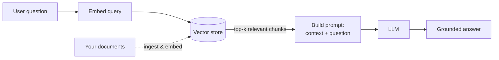

# RAG Lab

**Learn to build Retrieval-Augmented Generation systems — from your first 30-line script to production-grade pipelines — running entirely on your own machine.**

RAG Lab is a free, open learning portal. No API keys. No cloud bills. Every example is designed to run locally with open-source models via [Ollama](https://ollama.com), so you can experiment as much as you like.

-   :material-rocket-launch: **New to RAG?**

    Start with the fundamentals and build your first system in under an hour.

    [:octicons-arrow-right-24: What is RAG?](getting-started/what-is-rag.md)

-   :material-school: **Want the theory?**

    Understand embeddings, vector search, chunking, and retrieval from the ground up.

    [:octicons-arrow-right-24: Foundations](foundations/embeddings.md)

-   :material-code-braces: **Just want to build?**

    Jump into hands-on tutorials with copy-pasteable code.

    [:octicons-arrow-right-24: Tutorials](tutorials/index.md)

-   :material-cog: **Going to production?**

    Hybrid search, reranking, agentic RAG, evaluation, and scaling.

    [:octicons-arrow-right-24: Advanced](advanced/production.md)

## What is RAG, in one picture

RAG gives a language model **access to your data** at answer time. Instead of relying only on what the model memorized during training, you *retrieve* relevant passages from your own documents and *augment* the prompt with them before *generating* an answer.

The payoff: answers grounded in **your** content, with **fewer hallucinations**, **citable sources**, and **no retraining** when your data changes — you just update the index.

## The learning path

This portal is organized as a curriculum. You can read top-to-bottom, or jump to what you need.

| Stage | You'll learn to… |
|-------|------------------|
| **[Getting Started](getting-started/what-is-rag.md)** | Explain RAG, set up Python + Ollama, and run a local model. |
| **[Foundations](foundations/llm-basics.md)** | Reason about embeddings, vector databases, chunking, and retrieval. |
| **[Building Blocks](building-blocks/document-loaders.md)** | Assemble an ingestion → index → generation pipeline. |
| **[Tutorials](tutorials/index.md)** | Build a minimal RAG, a ChromaDB-backed app, a chat UI, and PDF Q&A. |
| **[Advanced](advanced/hybrid-search.md)** | Add hybrid search, reranking, agents, evaluation, and production hardening. |
| **[Tools](tools/index.md)** | Choose between LangChain, LlamaIndex, ChromaDB, FAISS, Qdrant, and more. |
| **[Projects](projects/index.md)** | Study and extend full, runnable sample applications. |

## Why local-first?

!!! tip "Everything here runs offline"
    We deliberately favor open-source, local tooling — **Ollama** for LLMs, **ChromaDB** for vectors, **sentence-transformers** for embeddings. You learn the *mechanics* of RAG without a paywall, and what you learn transfers directly to hosted APIs when you need them.

| Benefit | Why it matters for learning |
|---------|-----------------------------|
| **No cost** | Iterate freely without metering every token. |
| **Privacy** | Your documents never leave your machine. |
| **Transparency** | You see every component — nothing hidden behind an API. |
| **Portability** | The same architecture works with hosted models later. |

## Ready?

Begin here → **[What is RAG?](getting-started/what-is-rag.md)**

---

!!! info "About this project"
    RAG Lab is open source, built by [Sitharaj](https://sitharaj.in). Found a bug or want to add a tutorial? See the
    [contributing guide](https://github.com/sitharaj88/rag-lab/blob/main/CONTRIBUTING.md).
    Content is CC BY 4.0; sample code is MIT.

!!! tip "Enjoying RAG Lab?"
    If this portal helps you learn, consider [buying me a coffee ☕](https://www.buymeacoffee.com/sitharaj88) —
    it keeps the project free and growing. A ⭐ on [GitHub](https://github.com/sitharaj88/rag-lab) helps too!
