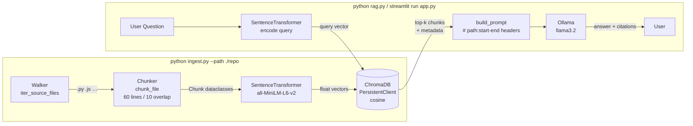

# Codebase Q&A — Local RAG for Source Code

Ask natural-language questions about any codebase and get grounded answers
with **file-path + line-range citations**, all running 100% locally.
No API keys. No data leaves your machine.

---

## What you'll learn

- How to adapt a RAG pipeline specifically for **source code** (line-based
  chunking, code-aware citations, a system prompt tuned for engineering Q&A)
- How to walk a directory tree, filter by extension, and avoid indexing noise
- How to store chunk metadata (file path, line numbers) alongside vectors so
  you can trace every answer back to exact source lines
- How to use ChromaDB's `PersistentClient` with cosine distance and
  sentence-transformers' `normalize_embeddings=True` for consistent retrieval
- How to wire Ollama's Python client into a RAG loop without any external API

---

## Architecture



---

## File-by-file walkthrough

### `config.py` — single source of truth

All tunable constants live here so you never have to grep the codebase to
change a setting:

```python
LINES_PER_CHUNK: int = 60
LINE_OVERLAP:    int = 10
TOP_K:           int = 6
OLLAMA_MODEL:    str = "llama3.2"
INCLUDE_EXTENSIONS: set = {".py", ".js", ".ts", ...}
SKIP_DIRS:          set = {".git", "node_modules", "__pycache__", ...}
MAX_FILE_BYTES:  int = 250_000
```

**Why 60 lines?**  Enough to capture a complete function or class method
without blowing the LLM context window (6 × ~60 lines ≈ 360 lines of context,
comfortably within llama3.2's 128 k-token window).

---

### `walker.py` — directory traversal + chunker

`iter_source_files(root)` uses `os.walk` with in-place pruning of `SKIP_DIRS`
to avoid descending into `.git`, `node_modules`, `__pycache__`, and the
project's own `chroma_db/` directory.

`chunk_file(filepath)` reads every file as UTF-8 (with `errors="replace"` so
binary noise doesn't crash the loop) and yields overlapping line windows:

```
lines 1-60   → Chunk(start_line=1,  end_line=60)
lines 51-110 → Chunk(start_line=51, end_line=110)   # 10-line overlap
lines 101-160 → Chunk(start_line=101, end_line=160)
…
```

Each `Chunk` is a `@dataclass` with `{path, start_line, end_line, text}`.

---

### `ingest.py` — embed and store

```bash
python ingest.py --path /path/to/repo [--reset]
```

Key design choices:

1. **Deterministic IDs** — `"<abs_path>::<start>-<end>"` — make re-runs
   idempotent: existing chunks are updated, new ones are added, nothing is
   duplicated.
2. **Batch encoding** (`batch_size=64`) keeps GPU/CPU utilisation high and
   avoids OOM on large repos.
3. **`normalize_embeddings=True`** ensures all vectors are unit-length, so
   ChromaDB's cosine distance is numerically equivalent to dot-product and
   scores are in `[0, 1]`.

---

### `rag.py` — retrieval + generation

`RAGPipeline.retrieve(query)` encodes the query with the same model used at
ingest time, queries ChromaDB for the top-k nearest neighbours, and converts
ChromaDB's cosine *distance* to a cosine *similarity* score
(`score = 1 - distance`).

`build_prompt(query, chunks)` formats the retrieved code with comment-style
headers:

```
# src/auth/middleware.py:1-60
def authenticate(request):
    token = request.headers.get("Authorization", "")
    …

---

# src/config/settings.py:20-55
JWT_SECRET = os.environ["JWT_SECRET"]
…

QUESTION: How does JWT authentication work?
```

The **system prompt** is the key to grounded answers:

```
You are a senior software engineer assistant helping a developer
understand an unfamiliar codebase.

Rules:
1. Answer ONLY from the code context provided below.
2. Cite every claim with the exact file reference shown in the context
   header, formatted as  path/to/file.py:start_line-end_line .
3. If the context does not contain enough information to answer,
   say "I don't see that in the indexed code." — do not guess.
…
```

---

### `app.py` — Streamlit chat UI

Uses `@st.cache_resource` to load the pipeline once per session (avoids
reloading the ~90 MB model on every interaction).  Each assistant reply
includes a collapsible **Sources** expander showing:

```
src/auth/middleware.py:1-60 — score 0.87
```

…followed by the raw code snippet in a fenced code block.

---

## Setup

```bash
# Prerequisites: Python ≥ 3.10, Ollama with llama3.2 pulled
ollama pull llama3.2

cd projects/codebase-qa
python -m venv .venv && source .venv/bin/activate
pip install -r requirements.txt

# Index a repo (defaults to current dir if --path omitted)
python ingest.py --path /path/to/your/repo

# CLI REPL
python rag.py

# Web UI
streamlit run app.py
```

---

## Configuration knobs

| Constant | Default | Effect |
|---|---|---|
| `LINES_PER_CHUNK` | 60 | Larger → more context per chunk, fewer chunks, higher memory |
| `LINE_OVERLAP` | 10 | Larger → less chance of missing cross-boundary logic |
| `TOP_K` | 6 | More → richer context, but longer prompts and slower LLM calls |
| `OLLAMA_MODEL` | `llama3.2` | Swap for `codellama`, `deepseek-coder`, etc. |
| `OLLAMA_TEMPERATURE` | 0.1 | Higher → more creative but less grounded answers |
| `MAX_FILE_BYTES` | 250 000 | Increase to index larger files (lock files, generated code) |
| `INCLUDE_EXTENSIONS` | see config | Add extensions for your stack (e.g. `.swift`, `.kt`) |
| `SKIP_DIRS` | see config | Add project-specific output dirs to avoid indexing build artefacts |

---

## Limitations

- **No AST or semantic parsing** — chunks are plain line windows.  A function
  that spans lines 55-130 may be split across two chunks.  The overlap
  (`LINE_OVERLAP`) mitigates this but doesn't eliminate it.
- **No incremental delete** — if you delete a file from the repo, its chunks
  remain in the index until you re-run with `--reset`.
- **Retrieval is lexical + semantic, not structural** — the pipeline cannot
  answer "show me all subclasses of Foo" without the LLM reasoning over
  retrieved text.
- **Large monorepos** — indexing 10 000+ files is fine but may take several
  minutes on CPU; consider filtering `INCLUDE_EXTENSIONS` to the languages you
  care about.

---

## How to extend

**Swap the embedding model**
Change `EMBEDDING_MODEL` in `config.py`.  Any `sentence-transformers`-
compatible model works; `BAAI/bge-small-en-v1.5` and
`nomic-ai/nomic-embed-text-v1` are good CPU-friendly alternatives.

**Use a code-specific LLM**
Set `OLLAMA_MODEL = "codellama"` or `"deepseek-coder"` — both are available
via `ollama pull`.

**Add a re-ranker**
After `retrieve()`, apply a cross-encoder (e.g.
`cross-encoder/ms-marco-MiniLM-L-6-v2`) to re-score and reorder the top-k
chunks before passing them to the LLM.

**Persist chat history to disk**
Replace the in-memory `st.session_state.chat_history` list in `app.py` with a
SQLite or JSON file so conversations survive page refreshes.

**AST-aware chunking**
Replace `walker.chunk_file()` with a `tree-sitter`-based splitter that cuts on
function / class boundaries for cleaner chunks and better citations.

---

## Next steps

- [Local RAG foundations](local-rag.md) — the simpler document RAG project
  this one builds on
- [Text splitting strategies](../building-blocks/text-splitting.md) — compare
  character, token, sentence, and AST-based splitters
- [Retrieval techniques compared](../advanced/retrieval-techniques-compared.md)
  — dense vs sparse vs hybrid retrieval, re-ranking
- [RAG with Ollama + Chroma tutorial](../tutorials/02-rag-with-ollama-chroma.md)
  — step-by-step tutorial covering the same stack
