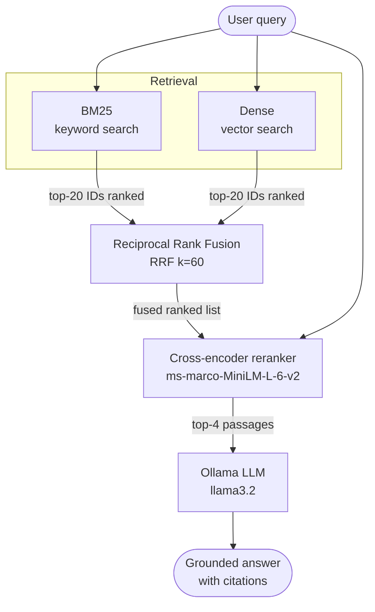

# Hybrid Search + Reranking RAG

A fully local pipeline that combines BM25 sparse retrieval, dense vector
search, Reciprocal Rank Fusion, and cross-encoder reranking before sending
context to an Ollama LLM.  No API keys.  Everything runs on your laptop.

This project is the natural next step after [local-rag.md](local-rag.md).
If you have not built a basic vector-search RAG pipeline yet, start there.

---

## What you'll learn

- Why a single retriever (BM25 *or* dense) leaves recall on the table.
- How Reciprocal Rank Fusion merges ranked lists without score normalisation.
- How a cross-encoder reranker improves precision by jointly reading the query
  and passage.
- How to expose intermediate pipeline results to *see* the difference each
  stage makes, rather than just measuring it.
- How to prompt a local LLM for grounded, cited answers.

---

## Pipeline overview



The diagram shows the two retrievers running in parallel, their results fused,
then a second model scoring each candidate against the query before the final
passages reach the LLM.

---

## Why each stage exists

### BM25 — the keyword anchor

BM25 (Best Match 25) is a probabilistic ranking function that counts how often
each query term appears in a document, weighted by the term's global rarity
(IDF) and normalised for document length.  It has been the backbone of
production search engines for decades.

Strengths:
- Exact keyword matches — product codes, error messages, rare technical terms.
- Zero training needed; no model to download.
- Deterministic and interpretable.

Weaknesses:
- "large language model" and "LLM" are unrelated to BM25.
- Paraphrases ("quick" vs "fast") score zero overlap.

The `rank-bm25` library's `BM25Okapi` class builds the index from a list of
token lists.  The demo uses simple whitespace tokenisation; production systems
benefit from lowercasing, stemming, and stopword removal.

### Dense retrieval — the semantic net

A bi-encoder (like `all-MiniLM-L6-v2` from `sentence-transformers`) maps
both the query and every chunk to a 384-dimension vector.  Cosine similarity
finds semantically close passages even when no words overlap.

ChromaDB stores and queries these vectors using an HNSW index.  With
`hnsw:space: cosine`, results are returned as a ranked list of IDs.

See [../sdks/sentence-transformers.md](../sdks/sentence-transformers.md) for
a deeper dive into how bi-encoders are trained and why cosine similarity works
for text.

### Reciprocal Rank Fusion — the merge layer

After both retrievers return their top-20 candidates, we have two ranked
lists.  We cannot simply average BM25 scores (term frequency integers) and
cosine similarities (floats in [0, 1]) — their scales are incompatible.

RRF solves this by using only the *rank* of each document:

```
RRF(doc) = sum over each list of  1 / (k + rank_in_list)
```

where `k=60` (the original paper's value) dampens the influence of rank
differences near the top.  A document ranked #1 in both lists scores
`1/(60+1) + 1/(60+1) ≈ 0.033`.  A document ranked #20 in one list and absent
from the other scores `1/(60+20) ≈ 0.013`.

Key properties:
- Scale-free: no normalisation needed.
- Works with any number of lists.
- Consistently outperforms learned fusion in zero-shot settings.

See [../advanced/hybrid-search.md](../advanced/hybrid-search.md) for
benchmarks and alternative fusion strategies.

### Cross-encoder reranking — the precision layer

A cross-encoder is a transformer that reads the *concatenation* of the query
and a passage as one sequence.  Its self-attention layers can model:

- Exact phrase matching within the passage.
- Negation ("Python is *not* faster than C").
- Entity co-reference ("it refers to…").

The `ms-marco-MiniLM-L-6-v2` model was fine-tuned on 500k human-labelled
query-passage pairs, giving it strong out-of-the-box performance.

The cross-encoder runs once per candidate, so it is called on the ~20 fused
candidates, not the full corpus.  This keeps latency to ~100–300 ms on CPU.

See [../advanced/reranking.md](../advanced/reranking.md) for a comparison of
cross-encoder architectures and tips for fine-tuning on your own data.

---

## File-by-file guide

### `config.py`

All constants in one place: paths, model names, and hyperparameters.  Key
values to understand:

| Constant | Default | Meaning |
|---|---|---|
| `CHUNK_SIZE` | 700 | Characters per chunk |
| `CHUNK_OVERLAP` | 120 | Shared characters between adjacent chunks |
| `CANDIDATES_K` | 20 | Chunks each retriever returns before fusion |
| `RRF_K` | 60 | RRF smoothing constant |
| `TOP_K` | 4 | Final chunks sent to the LLM after reranking |
| `EMBEDDING_MODEL` | `all-MiniLM-L6-v2` | Bi-encoder for dense retrieval |
| `RERANK_MODEL` | `cross-encoder/ms-marco-MiniLM-L-6-v2` | Cross-encoder reranker |
| `OLLAMA_MODEL` | `llama3.2` | Local LLM via Ollama |
| `OLLAMA_TEMPERATURE` | 0.1 | Low temp for factual, grounded answers |

### `ingest.py`

Reads every `*.md` file from `data/`, splits into overlapping character
windows, embeds with `SentenceTransformer`, and upserts into ChromaDB.

Critically, it also writes `chunks.json` — a flat mapping of
`{chunk_id: {text, source}}`.  BM25 is built from this JSON at query time,
ensuring both retrievers operate on the *exact same* corpus.

### `retrieval.py`

The `HybridRetriever` class exposes four public methods:

```python
retriever.bm25_search(query, k)         # sparse retrieval
retriever.dense_search(query, k)        # dense retrieval
retriever.reciprocal_rank_fusion(lists) # merge ranked lists
retriever.rerank(query, ids, k)         # cross-encoder scoring
retriever.search(query)                 # full pipeline + debug dict
```

`search()` returns a tuple of `(reranked_results, debug)`.  The `debug` dict
contains the intermediate ranked ID lists from each stage — this is what
`compare.py` uses to print the side-by-side breakdown.

### `rag.py`

Takes `reranked_results` from `retrieval.search()`, formats them into a
numbered context block (prefixed with source filenames), and sends a grounded
prompt to Ollama.  The system prompt instructs the model to cite sources and
refuse to answer if the context is insufficient.

The `--verbose` flag prints the per-stage retrieval debug before the answer,
making it easy to audit why the model said what it said.

### `compare.py`

The teaching script.  For a query you provide, it prints four panels:

1. BM25-only top results
2. Dense-only top results
3. Hybrid (RRF) top results
4. Hybrid + rerank top results

Each result shows the chunk ID, source file, relevance score (where
applicable), and a 120-character text snippet.

---

## Setup

### Prerequisites

- Python 3.10+
- [Ollama](https://ollama.com) installed (`ollama serve` running)
- `llama3.2` model: `ollama pull llama3.2`

### Install

```bash
python -m venv .venv
# macOS/Linux:
source .venv/bin/activate
# Windows:
.venv\Scripts\activate

pip install -r requirements.txt
```

### Ingest

```bash
python ingest.py
```

Output:

```
[ingest] Loaded rag-techniques.md (3842 chars)
[ingest] Loaded reranking-and-fusion.md (4210 chars)
[ingest] Loaded vector-search.md (3916 chars)
[ingest] Total chunks: 31
[ingest] chunks.json written → .../chunks.json
[ingest] Loading embedding model: all-MiniLM-L6-v2
[ingest] Embedding 31 chunks in batches of 64 …
[ingest] ChromaDB collection 'hybrid_rag_docs' has 31 documents.
```

---

## How to read `compare.py` output

Run:

```bash
python compare.py "BM25 term frequency saturation"
```

You will see four panels.  Things to look for:

**Panel 1 (BM25-only):** Does the top result contain the exact words
"term frequency" or "saturation"?  BM25 will surface chunks with those
keywords even if the surrounding context is not relevant.

**Panel 2 (Dense-only):** Does it find chunks that talk about *related*
concepts (IDF, scoring functions) even without the exact words?

**Panel 3 (Hybrid RRF):** Does the top-1 change?  If a chunk appeared in both
BM25 and dense lists, it should rise here.

**Panel 4 (Hybrid + Rerank):** Does the cross-encoder agree with RRF, or does
it surface a different chunk?  Disagreements are interesting — they mean the
cross-encoder found a subtly better match that the bi-encoder embeddings
ranked lower.

Try queries designed to expose each strategy's weakness:

```bash
# BM25 should win — exact rare term
python compare.py "BM25Okapi smoothed IDF"

# Dense should win — paraphrase
python compare.py "how does semantic similarity search work"

# Hybrid should win — mixed intent
python compare.py "Python HNSW index cosine distance"
```

---

## Honest limitations

**Hybrid + rerank helps most when:**
- Queries mix exact keywords with semantic intent.
- The corpus contains domain jargon that the embedding model handles imperfectly.
- Precision matters more than latency.

**Hybrid + rerank adds latency:**
- BM25 + dense retrieval: < 20 ms on CPU.
- Cross-encoder reranking (20 candidates): ~100–300 ms on CPU.
- Total pipeline: ~150–400 ms on a modern laptop.

**For small corpora (< 500 chunks),** the quality difference between dense-only
and hybrid+rerank is small.  The benefit grows with corpus size and query
diversity.

**The cross-encoder is English-only** (ms-marco-MiniLM).  For multilingual
RAG, use `cross-encoder/mmarco-mMiniLMv2-L12-H384-v1` instead.

---

## Next steps

- [local-rag.md](local-rag.md) — the simpler dense-only RAG baseline this
  project builds on.
- [../advanced/hybrid-search.md](../advanced/hybrid-search.md) — deep dive
  into sparse-dense fusion strategies and benchmark results.
- [../advanced/reranking.md](../advanced/reranking.md) — cross-encoder
  architectures, fine-tuning on domain data, and latency optimisation.
- [../advanced/retrieval-techniques-compared.md](../advanced/retrieval-techniques-compared.md)
  — side-by-side evaluation of BM25, dense, hybrid, and reranking on BEIR.
- [../sdks/sentence-transformers.md](../sdks/sentence-transformers.md) — full
  guide to `sentence-transformers`: bi-encoders, cross-encoders, training.
