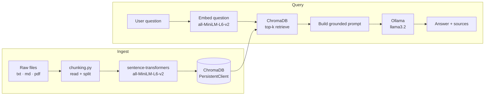

# Local RAG — Full Project Walkthrough

A fully self-contained Retrieval-Augmented Generation application that runs on your laptop: sentence-transformers for embeddings, ChromaDB for vector storage, Ollama (`llama3.2`) for generation, and an optional Streamlit chat UI — no internet connection or API key required.

## What you'll learn

- How the ingest and query paths are structured in a real codebase
- How config, chunking, indexing, retrieval, and generation are separated into distinct modules
- How to run the pipeline as both a REPL and a Streamlit chat app
- Which knobs to turn when quality is not where you want it

## Architecture



The ingest path runs once (or whenever your documents change). The query path runs on every user question.

## Project layout

```text
projects/local-rag/
├── config.py        # All tunable constants
├── chunking.py      # File reading and text splitting
├── ingest.py        # Orchestrates ingest: load → chunk → embed → store
├── rag.py           # RAGPipeline class + interactive REPL
├── app.py           # Streamlit chat UI
└── data/            # Sample Markdown documents
```

## File-by-file explanation

### `config.py` — single source of truth

```python
EMBEDDING_MODEL = "all-MiniLM-L6-v2"
CHUNK_SIZE      = 800
CHUNK_OVERLAP   = 120
TOP_K           = 4
OLLAMA_MODEL    = "llama3.2"
```

Every other module imports from `config.py`. Change a value here and it propagates everywhere — no hunting through multiple files.

### `chunking.py` — reading and splitting

`read_file(path)` handles `.txt`, `.md`, and `.pdf` files and returns a plain string. `split_text(text)` applies an overlapping sliding-window algorithm: each chunk is `CHUNK_SIZE` characters long, and consecutive chunks share `CHUNK_OVERLAP` characters so a sentence cut at a boundary still appears in full in at least one chunk. `load_chunks(data_dir)` walks a directory, reads every supported file, splits each one, and returns a flat list of `(chunk_text, source_filename)` tuples.

### `ingest.py` — building the index

```bash
python ingest.py           # first run — creates the ChromaDB collection
python ingest.py --reset   # wipe and rebuild from scratch
```

The script:

1. Calls `load_chunks` to read everything in `data/`
2. Encodes all chunk texts with `sentence_transformers.SentenceTransformer(EMBEDDING_MODEL)`
3. Stores texts, embeddings, and source metadata in a ChromaDB `PersistentClient` collection

!!! note "Incremental updates"
    The current implementation re-ingests all documents on every run. Use `--reset` when you add or change documents so stale chunks are removed before the new ones are added.

### `rag.py` — retrieval and generation

`RAGPipeline` is a plain Python class with two responsibilities:

- **`retrieve(question)`** — embeds the question and calls ChromaDB's `.query()` to return the `TOP_K` most similar chunks together with their source filenames.
- **`ask(question)`** — wraps `retrieve`, formats the chunks into a grounded prompt that instructs the model to answer only from the provided context, then calls `ollama.chat(model=OLLAMA_MODEL, ...)` and returns the response text and the source list.

Running `python rag.py` starts an interactive REPL: type a question, press Enter, get an answer with sources listed below it.

### `app.py` — Streamlit chat UI

```bash
streamlit run app.py
```

`app.py` wraps `RAGPipeline` in a `@st.cache_resource` so the model and Chroma collection are loaded once per session. The UI presents a chat input, streams the assistant reply into a chat message bubble, and appends a collapsible **Sources** expander listing the filenames of every chunk used to generate the answer.

## Setup and run

### Prerequisites

- Python 3.10+
- [Ollama installed and running](../tools/ollama.md)
- The repo cloned locally

### Step-by-step

```bash
# 1. Create and activate a virtual environment
python -m venv .venv
# Windows
.venv\Scripts\activate
# macOS / Linux
source .venv/bin/activate

# 2. Install dependencies
pip install sentence-transformers chromadb ollama streamlit pypdf

# 3. Pull the generation model
ollama pull llama3.2

# 4. Ingest your documents
cd projects/local-rag
python ingest.py

# 5a. Run the command-line REPL
python rag.py

# 5b. OR run the Streamlit chat app
streamlit run app.py
```

!!! tip "First ingest takes a minute"
    `sentence-transformers` downloads `all-MiniLM-L6-v2` (~90 MB) on first use and caches it locally. Subsequent runs are instant.

## Config knobs

| Variable | Default | Effect |
|----------|---------|--------|
| `CHUNK_SIZE` | `800` | Larger chunks carry more context per retrieval hit but dilute relevance. |
| `CHUNK_OVERLAP` | `120` | Higher overlap reduces boundary artifacts; raises storage cost. |
| `TOP_K` | `4` | Retrieve more chunks for broad questions; fewer for precise factual ones. |
| `OLLAMA_MODEL` | `llama3.2` | Swap for any model you have pulled locally (e.g. `mistral`, `phi3`). |
| `EMBEDDING_MODEL` | `all-MiniLM-L6-v2` | Replace with a larger model (e.g. `all-mpnet-base-v2`) for better recall at the cost of speed. |

## How to extend

- **Add your own documents** — drop `.txt`, `.md`, or `.pdf` files into `data/` and re-run `python ingest.py --reset`.
- **Support more file types** — add a new branch to `read_file` in `chunking.py` (e.g. `.docx` with `python-docx`).
- **Try a different embedding model** — update `EMBEDDING_MODEL` in `config.py` and re-ingest; no other changes needed.
- **Add metadata filtering** — pass a `where` clause to `collection.query()` in `rag.py` to restrict retrieval to a subset of sources.
- **Persist chat history** — store `(question, answer)` pairs in a SQLite file and display them in `app.py` on reload.

## Troubleshooting

!!! warning "Ollama connection refused"
    Make sure Ollama is running (`ollama serve` or the desktop app) before starting the pipeline. The default address is `http://localhost:11434`.

!!! warning "ChromaDB collection not found"
    Run `python ingest.py` before `python rag.py` or `streamlit run app.py`. The collection must exist before the query path can use it.

!!! warning "Poor answer quality"
    - Increase `TOP_K` to give the model more context.
    - Decrease `CHUNK_SIZE` so each chunk is more focused.
    - Check that your documents are in the `data/` directory and that `python ingest.py --reset` completed without errors.

!!! warning "Slow embedding on first run"
    `all-MiniLM-L6-v2` is downloaded on first use. If the download stalls, check your internet connection; the model is served from Hugging Face Hub.

## Next steps

- [Streamlit chat app tutorial](../tutorials/03-streamlit-chat-app.md)
- [Indexing pipeline deep-dive](../building-blocks/indexing-pipeline.md)
- [All tutorials](../tutorials/index.md)
