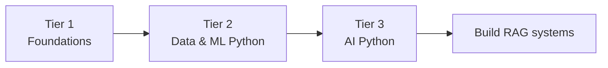

# Python Track

You don't need to be a Python expert to build RAG systems — but a solid footing makes everything that follows easier. This track takes you from "never written Python" to "comfortable building AI applications," in three tiers you can enter at your own level.

!!! tip "No math anxiety allowed here"
    A lot of people freeze up the moment they see words like *vector*, *algorithm*, or *matrix*. Here's the secret: **you almost never need the math to build great AI apps.** Every page in this track explains ideas with plain words and everyday examples first — a spreadsheet, a recipe, sorting your socks — and only mentions the fancy term afterwards, in case you're curious. If you ever see a formula, it's optional. You can skip it and nothing breaks. Promise.

## What you'll learn

- Set up a modern Python toolchain (`uv`, `ruff`, virtual environments).
- The core language: types, data structures, functions, classes, files, and errors.
- The data/ML stack that underpins embeddings and evaluation: NumPy, pandas, matplotlib, scikit-learn.
- "AI Python" — typing with Pydantic v2, async, packaging, and talking to model APIs.

## The three tiers

| Tier | For you if… | Covers |
|------|-------------|--------|
| **[Foundations](foundations/setup-and-tooling.md)** | You're new to Python or want a refresher. | Tooling, syntax & types, data structures, functions & modules, OOP, files & errors. |
| **[Data & ML Python](data-ml/numpy.md)** | You can write Python and want the numeric stack. | NumPy, pandas, matplotlib, scikit-learn. |
| **[AI Python](ai-python/typing-and-pydantic.md)** | You're ready to build robust AI apps. | Type hints + Pydantic v2, asyncio, packaging, working with model APIs. |

!!! tip "Already know Python?"
    Skip to **[AI Python](ai-python/working-with-model-apis.md)** for the patterns that matter most when calling LLMs and embedding models, then head into the [RAG Foundations](../foundations/embeddings.md) and [SDKs & Libraries](../sdks/index.md).

## A note on modern tooling

The Python packaging world moved fast. This track teaches the **2025–2026 modern default**: [`uv`](https://github.com/astral-sh/uv) for environments and installs (a fast drop-in for `pip`/`venv`), and [`ruff`](https://github.com/astral-sh/ruff) for linting and formatting. We always show the classic `python -m venv` + `pip` commands too, so nothing here depends on a tool you don't have.

!!! warning "Versions move"
    Library versions cited across this site were current in mid-2026 and will change. Treat exact version numbers as a snapshot — pin them in your own projects and check the official docs. See [Versions & deprecations](../sdks/versions-and-deprecations.md) for the fast-moving APIs to watch.

## Next steps

- Start the language at **[Setup & tooling](foundations/setup-and-tooling.md)**.
- Already fluent? Jump to **[Working with model APIs](ai-python/working-with-model-apis.md)**.
- Ready to build? Head to **[SDKs & Libraries](../sdks/index.md)** or the [Tutorials](../tutorials/index.md).
