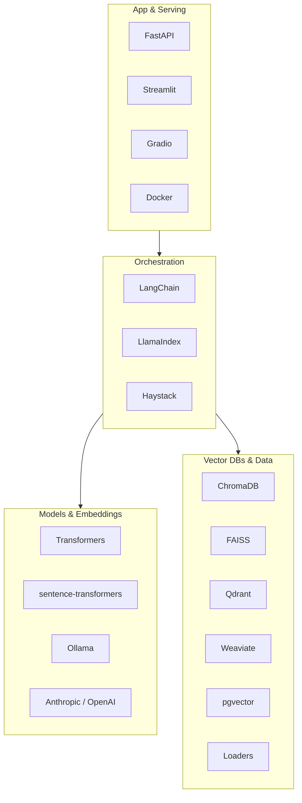

# SDKs & Libraries

The RAG ecosystem is a stack of specialized tools. This section is a hands-on, **current-API** tutorial for each major SDK and library — what it's for, how to install it, and a minimal working example using local-first defaults wherever possible.

## What you'll learn

- Which library does which job, and how they fit together.
- The **current** install/import conventions for each — and which older patterns to avoid.
- A minimal, runnable example per library you can lift into your own project.

!!! warning "Authored against mid-2026 APIs"
    These libraries change quickly. Every page here was written against versions verified in June 2026, and we call out recently-deprecated patterns explicitly. Before you build, skim **[Versions & deprecations](versions-and-deprecations.md)** — it's the cheat-sheet of what changed and what to watch.

## The stack at a glance

## Pick by role

| Role | Libraries | Start here |
|------|-----------|------------|
| **Orchestration** — tie retrieval + generation into pipelines/agents | LangChain, LlamaIndex, Haystack | [LangChain](langchain.md) |
| **Models & embeddings** — run and call models | Transformers, sentence-transformers, Ollama SDK, Anthropic/OpenAI | [sentence-transformers](sentence-transformers.md) |
| **Vector DBs & data** — store vectors, load documents | ChromaDB, FAISS, Qdrant, Weaviate, pgvector, loaders | [FAISS](faiss.md) |
| **App & serving** — ship a UI or API | FastAPI, Streamlit, Gradio, Docker | [Streamlit](streamlit.md) |

!!! tip "ChromaDB lives in Tools"
    ChromaDB and the broader vector-store comparison have dedicated pages under
    [Tools → ChromaDB](../tools/chromadb.md) and [Tools → Vector stores](../tools/vector-stores.md).
    The pages here focus on the *other* stores (FAISS, Qdrant, Weaviate, pgvector).

## Do I need a framework at all?

No. You can build excellent RAG with just an embedding model, a vector store, and an LLM client — that's exactly what the [sample project](../projects/local-rag.md) does. Frameworks like LangChain and LlamaIndex add convenience (loaders, splitters, retrievers, agents) once your needs grow. Learn the raw mechanics first; reach for a framework when it earns its keep.

## Next steps

- Read the **[Versions & deprecations](versions-and-deprecations.md)** cheat-sheet first.
- Then dive into **[LangChain](langchain.md)** or **[LlamaIndex](llamaindex.md)**.
- Need the Python under it? See the **[Python Track](../python/index.md)**.
